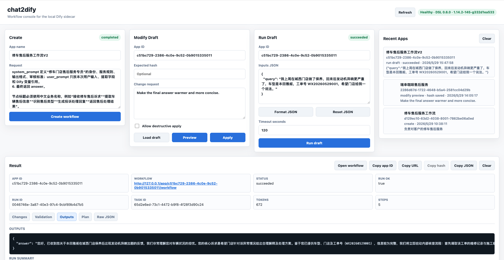
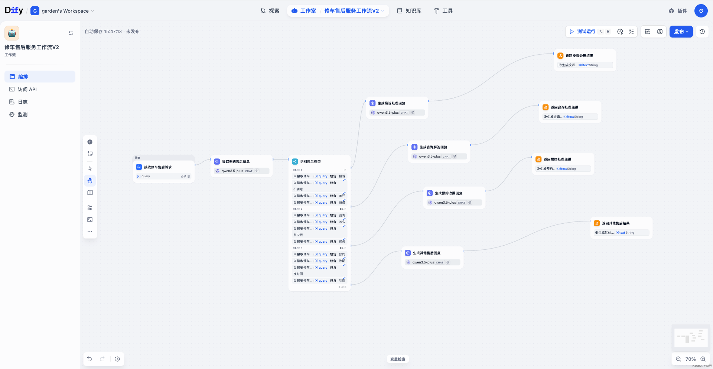

# chat2dify

Generate Dify Workflows via Natural Language Conversation.

## Phase 1 MVP

This repository runs as an independent FastAPI sidecar. It does not modify Dify
source code and targets the sibling latest Dify checkout:

```env
DIFY_SOURCE_DIR=../dify
DIFY_CONSOLE_API_BASE=http://127.0.0.1/console/api
DIFY_CONSOLE_WEB_BASE=http://127.0.0.1
DIFY_DEFAULT_DATASET_IDS=
```

`DIFY_SOURCE_DIR` is resolved relative to the `chat2dify` repository root. On
startup the sidecar verifies that the directory exists and that
`api/constants/dsl_version.py` can be read. The app DSL version is read from
that file at runtime instead of being hardcoded.

When running Dify through `../dify/docker/docker-compose.yaml`, the API service
listens on `5001` inside the Docker network but is not published directly to the
host. Use the nginx route instead:

```env
DIFY_CONSOLE_API_BASE=http://127.0.0.1/console/api
DIFY_CONSOLE_WEB_BASE=http://127.0.0.1
```

The second-stage flow is:

```text
user request -> raw LLM plan -> normalized WorkflowPlan IR -> Dify DSL YAML -> validation -> /console/api/apps/imports
```

The create API returns the imported Dify `app_id` and a console workflow URL in
the form `/app/{app_id}/workflow`.

Draft/create responses include `raw_plan`, normalized `plan`, rule-based
`explanation`, `planner` metadata, `dsl`, and structured validation issues.

## Screenshots

Web UI workbench for create, modify, and draft run:



Dify draft workflow generated from the repair after-sales example:



The third-stage edit flow modifies an existing Dify draft in place:

```text
app_id + edit request -> Dify draft graph -> WorkflowPlan IR -> revised WorkflowPlan IR -> validation -> /console/api/apps/{app_id}/workflows/draft
```

Use `POST /api/workflows/modify/draft` to preview a modification and
`POST /api/workflows/modify/apply` to write it back to the Dify draft. Both
accept `app_id`, `message`, and optional `expected_hash`; apply returns the new
Dify draft `hash`. Third-stage edits support the stabilized node set listed
below and do not publish the workflow. Edits run in safe mode by default:
large node deletions, start/end rewrites, or broad edge rewiring are reported in
`guard` and blocked on apply unless `allow_destructive=true` is sent. No-op
edits return `sync.result="noop"` and are not written back to Dify.

Use `GET /api/workflows/{app_id}/draft` to inspect the current Dify draft
without calling an LLM or writing anything back. The response includes the
current draft hash, Dify app metadata when available, the decompiled Plan IR,
and validation diagnostics.

The fourth-stage validation flow runs an existing Dify workflow draft with
explicit test inputs and returns a blocking summary:

```text
app_id + inputs -> Dify draft run SSE -> terminal event -> run summary
```

Use `POST /api/workflows/run/draft` with `app_id` and `inputs`. The sidecar
does not generate test inputs, does not publish the workflow, and does not
assume an OpenAI provider; generated workflows use the configured
`DIFY_DEFAULT_MODEL_PROVIDER` / `DIFY_DEFAULT_MODEL_NAME` values, such as
Tongyi/Qwen.

## Setup

```bash
python3 -m venv .venv
source .venv/bin/activate
pip install -r requirements.txt
cp .env.example .env
```

The sidecar reads `.env` from the repository root and lets real environment
variables override file values. Fill these values before using
`/api/workflows/create`:

```env
DIFY_EMAIL=you@example.com
DIFY_PASSWORD=your-password
```

If `OPENAI_API_KEY` is not set, the draft endpoint uses a deterministic fallback
plan (`start -> llm -> end`) so the MVP can still produce a valid DSL. When it
is set, the planner tries up to three LLM attempts and feeds validation errors
back into the model for self-repair.

Knowledge retrieval workflows require real Dify dataset IDs. Configure a
comma-separated default in `.env`, or use the Web UI Knowledge panel to search
and select datasets from the local Dify workspace. Manual dataset IDs remain
available as an advanced fallback, and Web UI selections override the default
for Create and Modify requests:

```env
DIFY_DEFAULT_DATASET_IDS=dataset_id_1,dataset_id_2
```

Tool nodes require tools that are already installed and configured in Dify. Use
the Web UI Tools panel to search and select installed builtin, API, workflow, or
MCP tools. Only selected tools are exposed to the planner; chat2dify does not
install plugins, edit credentials, or let the LLM guess provider IDs. The Web UI
also lets you configure each selected tool's runtime inputs and form settings;
those explicit bindings are sent in `tool_selections[].tool_parameters` and
`tool_selections[].tool_configurations` and take precedence over LLM-generated
values.

Agent nodes require Agent Strategy plugins that are already installed and
configured in Dify. Use the Web UI Agents panel to search and select strategies,
then configure their required parameters. If a strategy parameter requires a
Tool, bind one of the tools already selected in the Tools panel. Only selected
agent strategies are exposed to the planner; chat2dify does not install plugins,
edit credentials, or create Agent Roster records.

## Run

```bash
uvicorn app.main:app --host 127.0.0.1 --port 8000
```

Open the local Web UI:

```text
http://127.0.0.1:8000/
```

Recommended Web UI edit flow:

```text
Load draft -> Preview -> Apply reviewed preview
```

The Web UI applies the exact Plan IR returned by Preview. It does not ask the
LLM to generate a second modification during Apply.

Health check:

```bash
curl http://127.0.0.1:8000/health
```

List Dify datasets for the Web UI selector:

```bash
curl 'http://127.0.0.1:8000/api/dify/datasets?keyword=售后&page=1&limit=50'
```

List installed Dify tools for the Web UI selector:

```bash
curl 'http://127.0.0.1:8000/api/dify/tools?keyword=search&provider_type=all'
```

List installed Dify Agent Strategies for the Web UI selector:

```bash
curl 'http://127.0.0.1:8000/api/dify/agent-strategies?keyword=react'
```

Draft a workflow without importing it:

```bash
curl -X POST http://127.0.0.1:8000/api/workflows/draft \
  -H 'Content-Type: application/json' \
  -d '{"message":"Summarize the user input","app_name":"Summary MVP","dataset_ids":["OPTIONAL_DATASET_ID"]}'
```

Create or draft a workflow that may use a selected Dify tool by passing the
tool object returned by `/api/dify/tools`:

```json
{
  "message": "先调用所选搜索工具查询信息，再由 LLM 总结并返回 answer",
  "app_name": "Tool summary workflow",
  "tool_selections": [
    {
      "provider_id": "PROVIDER_ID_FROM_DIFY",
      "provider_type": "builtin",
      "provider_name": "provider_name",
      "tool_name": "tool_name",
      "tool_label": "Tool label",
      "parameters": [],
      "output_schema": {},
      "tool_parameters": {
        "query": {"type": "mixed", "value": "{{#start.query#}}"}
      },
      "tool_configurations": {}
    }
  ]
}
```

Create or draft a workflow that may use a selected Dify Agent Strategy by
passing the strategy object returned by `/api/dify/agent-strategies`:

```json
{
  "message": "用所选智能体分析客户问题并生成处理建议，最后返回 answer",
  "app_name": "Agent support workflow",
  "agent_selections": [
    {
      "agent_strategy_provider_name": "PROVIDER_FROM_DIFY",
      "agent_strategy_name": "STRATEGY_FROM_DIFY",
      "agent_strategy_label": "Strategy label",
      "parameters": [],
      "output_schema": {},
      "agent_parameters": {
        "query": {"type": "variable", "value": ["start", "query"]}
      },
      "plugin_unique_identifier": "PLUGIN_UNIQUE_IDENTIFIER_FROM_DIFY",
      "meta": {"version": "1.0.0"}
    }
  ]
}
```

Create a workflow in Dify:

```bash
curl -X POST http://127.0.0.1:8000/api/workflows/create \
  -H 'Content-Type: application/json' \
  -d '{"message":"Summarize the user input","app_name":"Summary MVP","dataset_ids":["OPTIONAL_DATASET_ID"]}'
```

Preview a change to an existing Dify workflow draft:

```bash
curl -X POST http://127.0.0.1:8000/api/workflows/modify/draft \
  -H 'Content-Type: application/json' \
  -d '{"app_id":"YOUR_APP_ID","message":"Make the final answer warmer","dataset_ids":["OPTIONAL_DATASET_ID"]}'
```

Inspect the current Dify workflow draft without modifying it:

```bash
curl http://127.0.0.1:8000/api/workflows/YOUR_APP_ID/draft
```

Apply the change to the Dify draft:

```bash
curl -X POST http://127.0.0.1:8000/api/workflows/modify/apply \
  -H 'Content-Type: application/json' \
  -d '{"app_id":"YOUR_APP_ID","message":"Make the final answer warmer","expected_hash":"OPTIONAL_CURRENT_HASH"}'
```

Apply a reviewed preview plan without re-running the edit planner. The `plan`
value should be the exact `plan` object returned by `modify/draft`:

```json
{
  "app_id": "YOUR_APP_ID",
  "message": "Make the final answer warmer",
  "expected_hash": "PREVIEW_BASE_HASH",
  "dataset_ids": ["OPTIONAL_DATASET_ID"],
  "plan": {
    "...": "copy the full preview plan object here"
  }
}
```

Allow a confirmed destructive rewrite:

```bash
curl -X POST http://127.0.0.1:8000/api/workflows/modify/apply \
  -H 'Content-Type: application/json' \
  -d '{"app_id":"YOUR_APP_ID","message":"Rebuild this draft into a simpler workflow","allow_destructive":true}'
```

Run a Dify workflow draft with explicit inputs:

```bash
curl -X POST http://127.0.0.1:8000/api/workflows/run/draft \
  -H 'Content-Type: application/json' \
  -d '{"app_id":"YOUR_APP_ID","inputs":{"query":"我要投诉订单配送太慢"},"timeout_seconds":120}'
```

## Supported Nodes

The current Plan IR supports these node types:

```text
start, llm, code, if-else, end, http-request, template-transform,
question-classifier, parameter-extractor, variable-aggregator,
document-extractor, assigner, list-operator, knowledge-retrieval,
human-input, iteration, iteration-start, loop, loop-start, loop-end,
tool, agent, datasource, datasource-empty, knowledge-index,
trigger-webhook, trigger-plugin, trigger-schedule
```

`question-classifier` is used for semantic routing such as complaint /
consultation / appointment branches. `parameter-extractor` is used to extract
structured fields such as `order_id`, `car_model`, `store`, and `issue` from
the user input. `document-extractor` can extract text from uploaded files,
`list-operator` can filter/sort/limit arrays, and `variable-aggregator` can
merge fallback variables into one output. `assigner` is supported for existing
draft compatibility but is not generated by default for new workflow requests.
`knowledge-retrieval` retrieves context from dataset IDs selected in the Web UI
or configured in `DIFY_DEFAULT_DATASET_IDS`; `answer` remains out of scope for
workflow mode. `human-input` is available for explicit manual review or approval
steps; draft runs that reach it return `status=paused`, and the human action is
still completed in the Dify UI in this stage. `iteration` is used for explicit
batch/list traversal, while `loop` is used for explicit retry/repeat/until or
max-N-times flows. `iteration-start`, `loop-start`, and `loop-end` are internal
Dify graph children generated inside their parent container, not ordinary
top-level business nodes.
`tool` can be generated when the request includes explicit `tool_selections`
from the Web UI/API and the user asks to call a tool. String tool inputs such as
`url`, `query`, and `text` are represented as Dify mixed text values like
`{{#start.query#}}`; boolean, number, and select settings use Dify ToolInput
constant/variable structures. Existing `_raw_data` tool nodes are still
preserved as passthrough for draft compatibility. `agent` can be generated when
the request includes explicit `agent_selections` from the Web UI/API and the
user explicitly asks for an Agent/智能体/autonomous multi-step flow. Agent
parameters use the same Dify `{type,value}` input structure, and Agent
tool-selector parameters must bind tools selected in the Web UI Tools panel.
Existing `_raw_data` agent nodes are still preserved as passthrough for old
draft compatibility. `datasource`、`datasource-empty`、`knowledge-index` 和
`trigger-*` 节点目前仍作为外部依赖节点兼容层：chat2dify 可以读取已有 Dify 草稿并
尽量原样写回这些节点，Web UI 会展示 warning 诊断；新建 workflow 时 planner 不主动
生成它们。

Example file workflow request:

```text
创建维修单附件总结工作流。用户上传维修单文件，先提取文件文本，再总结车辆问题、维修建议和需要补充的信息，最后返回 answer。
```

Example list workflow request:

```text
创建售后记录筛选工作流。输入 items 是包含 records 数组的 JSON 对象，筛选投诉类记录并取第一条，然后生成客服回复，最后返回 answer。
```

Example knowledge workflow request:

```text
创建修车售后知识库问答工作流。输入 query 是客户售后问题，先从门店售后政策知识库检索相关资料，再用模型结合资料生成客服回复，最后返回 answer。
```

Example human review workflow request:

```text
创建售后人工审核工作流。输入 query 是客户售后诉求，先生成客服回复草稿，再交给经理人工审核；经理可以选择通过或驳回，通过时返回草稿，驳回时返回人工审核意见。
```

Example batch iteration workflow request:

```text
创建批量售后记录处理工作流。输入 items 是包含 records 数组的 JSON 对象，遍历每条售后记录，逐条生成处理建议，最后返回建议列表 answer。
```

Example retry loop workflow request:

```text
创建最多 3 次维修状态检查工作流。输入 query 是客户提供的维修单号和问题，循环检查处理状态，满足可回复条件或达到 3 次后生成最终回复，最后返回 answer。
```

Example selected tool workflow request:

```text
创建工具查询总结工作流。先调用我在 Web UI 勾选的搜索工具查询客户问题相关信息，再用模型总结查询结果并生成客服回复，最后返回 answer。
```

Example selected agent workflow request:

```text
创建智能体售后分析工作流。使用我在 Web UI 勾选的 Agent Strategy 对客户问题进行多步分析，必要时调用已绑定工具，最后生成处理建议并返回 answer。
```

Answer/chatflow nodes, plugin installation, credential editing, automatic
creation of trigger/data-source nodes, Agent Roster management, and model
capability registry sync remain out of scope for now.

## Test

```bash
python3 -m pytest
```
