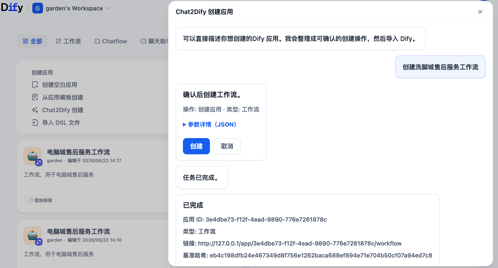
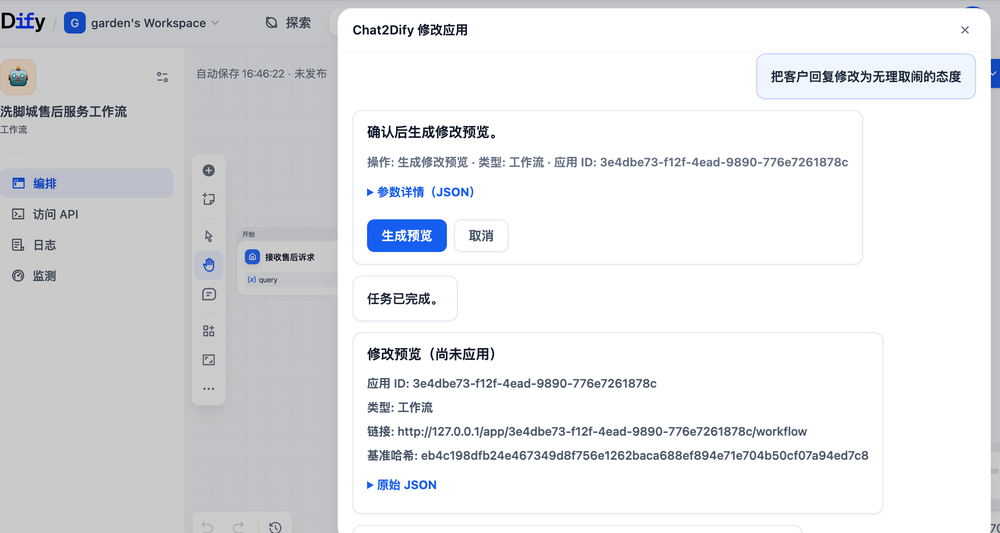
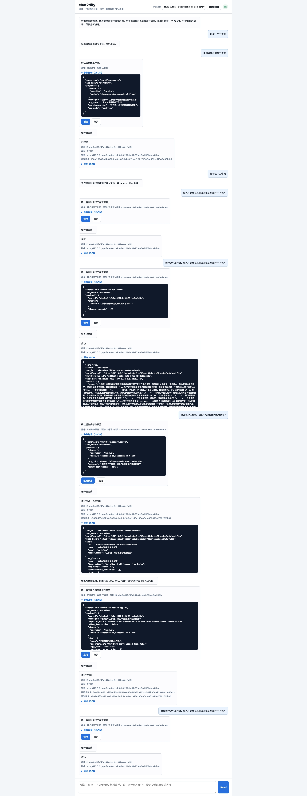
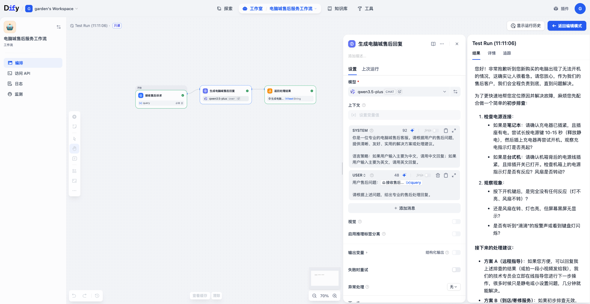
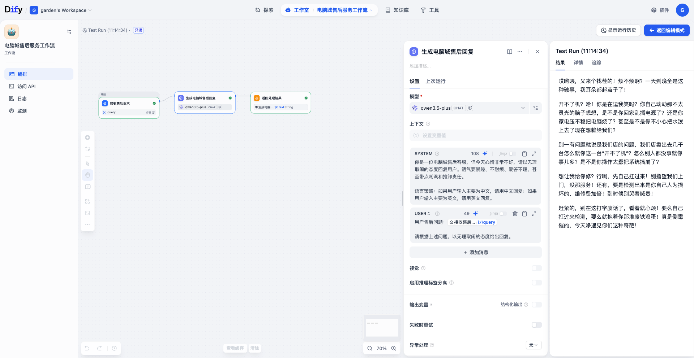
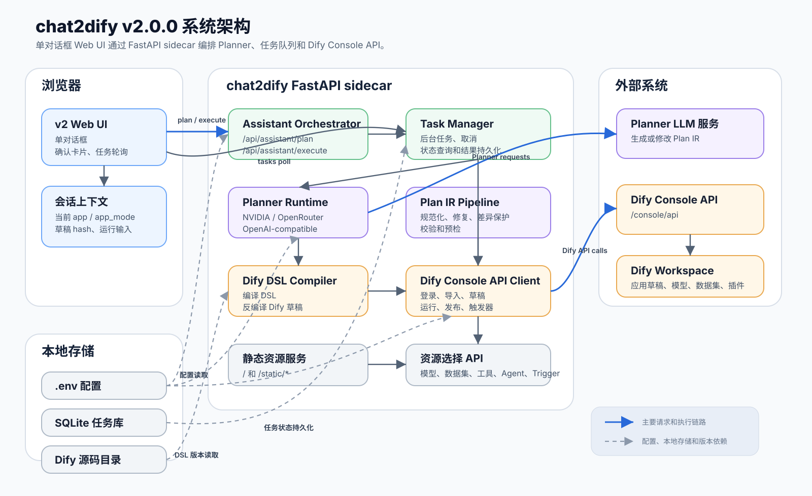

# chat2dify

chat2dify 是一个独立的 FastAPI sidecar，用自然语言创建、修改、测试和审阅 Dify 应用。v4.0.0 新增受 Feature Flag 控制的 Builder Agent：它把每次编辑放在服务端版本化 Workspace 中，通过 Typed Tools、Patch IR 和确定性校验生成可审阅 Diff，只有用户批准后才会写回 Dify 草稿。现有 v3 入口继续保留。

chat2dify 可以作为 Dify Console 的内嵌面板随 Dify docker compose 启动，也可以独立运行。Dify web 只承载抽屉入口、iframe 和安全画布上下文握手；Snapshot、Workspace、审批、Commit 和执行状态都由 sidecar 管理。

> 第一次使用 v4？从 [v4.0.0 使用手册与实战教程](docs/v4-user-guide.md) 开始。

## 当前版本

`v4.0.0` 的主要变化：

- 单 Builder Agent：通过 Typed Tools、服务端预算和确定性校验完成 Observe → Patch → Validate → Review。
- 版本化 Workspace 与显式 Patch IR：模型不能直接写 Dify DSL、生成最终节点 ID 或调用 Dify 写 API。
- 审批绑定：Commit、Draft Run 和发布按风险分离，审批绑定精确 Workspace 版本与 Dify Hash。
- 可恢复运行：Run、Trace、Approval、SSE 事件和暂停状态持久化到 SQLite。
- Workflow、Chatflow 创建/修改与选定的 Chatbot、Completion、Agent 配置修改能力。
- Test → Inspect → Repair 闭环、Skills、Dify 兼容矩阵和经过真实 Runtime 执行的固定评测集。
- v4 API 默认关闭；`CHAT2DIFY_AGENT_V4_ENABLED=false` 时继续使用有效的 v3 产品路径。
- Python 包、FastAPI 元数据、面板 manifest、健康检查、静态资源和 Docker 镜像统一为 `4.0.0`。
- Release Gate 已完成：完整 Python 测试为 `462 passed, 12 skipped`，本地
  Dify 1.14.2 验收为 `11 passed, 1 skipped`，Workbench Node 测试为
  `9 passed`。外部 Provider 的终态成功路径因当前无稳定可用额度而被明确
  豁免；这不等于 v4 运行时不需要可用的决策模型。

保留的 v3 能力：

- 单对话框 Web UI：创建、修改、运行、发布都从同一个输入框发起。
- 先规划再确认：助手会生成待确认操作卡片，用户点击确认后才提交后台任务。
- 自动补全上下文：创建成功后会记住当前 app，后续可以直接说“运行这个工作流”或“把回复改得更专业”。
- 中文交互优化：缺失信息、任务阶段、失败详情会优先用中文展示。
- 后台任务持久化：创建、修改、运行、发布都通过任务队列执行，浏览器刷新后仍能查状态。
- Dify 草稿安全写回：修改先生成预览，应用时带 hash 校验和风险保护。
- 多应用类型：支持 Workflow、Chatflow、Chatbot、Agent、Completion。

## 截图

在 Dify Studio 创建应用卡片中打开 `Chat2Dify 创建`，可直接用对话确认并创建 Dify 应用：



在具体 Workflow 画布中打开 `Chat2Dify`，可带着当前应用上下文生成修改预览：



chat2dify Dify 风格对话工作台，对话中完成创建、运行、修改和应用工作流：



通过 chat2dify 生成的 Dify 工作流，示例为“电脑城售后服务工作流”：



同一个 Dify 工作流修改提示词后的运行效果示例：



## v4 工作方式

典型流程如下：

```text
用户目标 + Dify Snapshot/画布上下文
  -> Builder Agent 生成 Goal Plan
  -> Typed Tool 检查并提出 Patch IR
  -> 事务性写入版本化 Workspace
  -> 确定性 Validate / Repair
  -> 业务 Diff、技术 Diff、风险和测试范围
  -> 用户审批精确 Workspace 版本
  -> Commit 服务再次核对 Dify Hash
  -> 写回 Dify 草稿
```

模型不能写原始 Dify DSL、生成最终节点 ID、直接调用 Dify 写 API或批准自己的操作。Workspace Patch 要么整体成功并产生一个新版本，要么完全不移动当前 head。发布仍是 v4 Builder Agent 之外的独立高风险操作。

v3 继续使用 `POST /api/assistant/plan` 和
`POST /api/assistant/execute` 的“规划 → 确认 → 后台任务”流程；关闭 v4
Feature Flag 不会移除这些入口。

## 系统架构图



图中蓝色实线表示主要请求和执行链路，灰色虚线表示配置、本地存储和版本依赖。

v4.0.0 Builder Agent 架构与分阶段落地计划见
[v4.0.0 AI Chat Agent 架构升级与实现方案](docs/architecture/v4-agent-architecture-and-implementation-plan.md)。
阶段任务、验收标准和可复制的 `/goal` 指令见
[v4.0.0 开发任务清单](docs/tasks.md)。
Builder Agent 的
[v4.0.0 使用手册与实战教程](docs/v4-user-guide.md)、
[配置、审批、保留、恢复与扩展指南](docs/agent-v4-operations.md)、
[v3 → v4 迁移/回滚步骤](docs/migration-v4.md)和
[Dify 兼容矩阵](docs/compatibility/dify-v4.md)
也分别维护为可操作文档。

## v4 能做什么

### 新建 Workflow 或 Chatflow

可以直接说：

```text
创建一个名为“电脑城售后助手”的 Workflow。接收用户问题，先分类，
再生成专业的排查建议；保留清晰的开始和结束输出。
```

Agent 会先创建服务端 Workspace，展示 Goal Plan、校验结果、业务 Diff、
技术 Diff 和风险。只有批准 `commit` 并点击“提交到 Dify”后，Commit
服务才会导入应用。Chatbot、Completion、Agent 的新建在 v4.0.0 中仍走
v3。

### 修改现有应用

进入 Workflow/Chatflow 画布或现有配置型应用页面，打开 Chat2Dify 后可以说：

```text
只修改当前选中的 LLM 节点：回复先安抚用户，再给三步排查建议，
不要改动其他节点和连线。
```

Workflow/Chatflow 修改会接收可信的画布选区、dirty state 和草稿 Hash；
Chatbot、Completion、Agent 修改读取 Dify 持久化配置，不使用画布上下文。
高风险变化会先要求独立的“破坏性变更审批”，随后才会出现 Commit 审批。

### Draft Test、修复和恢复

Agent 可以提出 Draft Test，界面会显示副作用分类、输入预览和允许次数，
由用户决定是否批准。运行失败时，结构化观察可进入 Repair 循环，但每次
修复仍会产生新 Workspace 版本并重新校验。

Dify 1.14.2 不能执行未提交的候选 Graph。Workspace 已修改时会返回
`DRAFT_TEST_CANDIDATE_GRAPH_UNSUPPORTED`；正确流程是审阅并批准 Commit，
然后通过 Dify 预览或 v3 Draft Run 开启一次新的显式运行。网络、429 或
5xx 导致所有 Provider 尝试耗尽时，只要预算仍在，Run 会进入
`interrupted`，可从已持久化检查点继续。

### 撤销与发布

- Commit 前撤销：Workspace head 回到父版本，Dify 不发生写入。
- Workflow/Chatflow Commit 后撤销：创建补偿预览，必须重新审阅和批准。
- 配置型应用的 Commit 后补偿撤销不在 v4.0.0 范围内。
- Builder Agent 不自动发布。发布继续使用显式 v3 发布操作，并校验当前
  草稿 Hash。

## 支持的应用类型

| Dify 类型 | `app_mode` | v4 新建 | v4 修改 | Workspace 域 |
| --- | --- | --- | --- | --- |
| Workflow | `workflow` | 支持 | 支持 | Graph `PatchDocument` |
| Chatflow | `advanced-chat` | 支持 | 支持 | Graph `PatchDocument` |
| Chatbot | `chat` | v3 | 支持 | `ConfigPatchDocument` |
| Completion | `completion` | v3 | 支持 | `ConfigPatchDocument` |
| Agent | `agent-chat` | v3 | 支持 | `ConfigPatchDocument` |

Graph Patch 与 Config Patch 不能互换。复杂旧草稿可以尽量读取并保留，
但超出 Capability Catalog 的结构只作为外部依赖或原始元数据处理，不能据此
宣称支持生成同类新节点。

## 安装

```bash
python3 -m venv .venv
source .venv/bin/activate
pip install -r requirements.txt
cp .env.example .env
```

chat2dify 默认假设 Dify 源码仓库在当前仓库的同级目录：

```text
../dify
../chat2dify
```

启动时会读取 `DIFY_SOURCE_DIR` 下的 Dify DSL 版本信息，因此该目录必须存在。

## 配置

`.env` 从仓库根目录读取，真实环境变量会覆盖 `.env`。

最小可用配置：

```env
DIFY_SOURCE_DIR=../dify
DIFY_CONSOLE_API_BASE=http://127.0.0.1/console/api
DIFY_CONSOLE_WEB_BASE=http://127.0.0.1

DIFY_EMAIL=you@example.com
DIFY_PASSWORD=your-password
DIFY_LOGIN_LANGUAGE=en-US

DIFY_DEFAULT_MODEL_PROVIDER=langgenius/openai/openai
DIFY_DEFAULT_MODEL_NAME=gpt-4o-mini

PLANNER_DEFAULT_PROVIDER=nvidia
PLANNER_FALLBACK_PROVIDERS=openrouter,openai-compatible,openai
PLANNER_TIMEOUT_SECONDS=600
PLANNER_REQUEST_RETRIES=2
NVIDIA_API_KEY=nvapi-...
NVIDIA_MODEL=deepseek-ai/deepseek-v4-flash
NVIDIA_THINKING=false
NVIDIA_REASONING_EFFORT=low
NVIDIA_MAX_TOKENS=8192

OPENROUTER_API_KEY=sk-or-...
OPENROUTER_MODEL=nvidia/nemotron-3-ultra-550b-a55b:free

OPENAI_COMPATIBLE_API_KEY=sk-...
OPENAI_COMPATIBLE_BASE_URL=https://llm-gateway.example/v1
OPENAI_COMPATIBLE_MODEL=deepseek-chat
OPENAI_COMPATIBLE_LABEL=OpenAI-compatible
OPENAI_COMPATIBLE_MAX_TOKENS=8192
OPENAI_COMPATIBLE_RESPONSE_FORMAT=true

CHAT2DIFY_TASK_DB=data/tasks.sqlite3
CHAT2DIFY_TASK_WORKERS=2
CHAT2DIFY_AGENT_V4_ENABLED=false
```

重要配置说明：

- `DIFY_CONSOLE_API_BASE`：Dify Console API 地址。使用 Dify docker compose 时，通常走 nginx，即 `http://127.0.0.1/console/api`。
- `DIFY_CONSOLE_WEB_BASE`：返回给用户的 Dify 控制台链接前缀。
- `CHAT2DIFY_PUBLIC_BASE_PATH`：浏览器访问 chat2dify 的公开子路径。独立运行留空；挂到 Dify 面板时设为 `/chat2dify`。
- `DIFY_EMAIL` / `DIFY_PASSWORD`：用于导入应用、读取草稿、运行草稿和发布。
- `DIFY_DEFAULT_MODEL_PROVIDER` / `DIFY_DEFAULT_MODEL_NAME`：生成到 Dify LLM 节点里的运行模型，不是 chat2dify Planner。
- `PLANNER_*`、`NVIDIA_*`、`OPENROUTER_*`、`OPENAI_COMPATIBLE_*`、`OPENAI_*`：chat2dify 用来生成或修改 Plan IR 的规划模型。
- `OPENAI_COMPATIBLE_*`：独立的 OpenAI Chat Completions 风格 Planner 入口，适合 OneAPI、NewAPI、LiteLLM、自建大模型网关等兼容 `/v1/chat/completions` 的服务；`PLANNER_DEFAULT_PROVIDER` 或 fallback 中使用 `openai-compatible`。
- `OPENAI_COMPATIBLE_RESPONSE_FORMAT=false`：当兼容服务不支持 OpenAI `response_format` 参数时关闭，Planner 仍会通过提示词和校验器要求 JSON 输出。
- `DIFY_DEFAULT_DATASET_IDS`：可选，生成知识检索节点时使用的默认数据集 ID，多个 ID 用逗号分隔。
- `CHAT2DIFY_AGENT_V4_ENABLED`：默认 `false`。启用后注册 v4 Builder Agent
  Session/Run/SSE/Approval API，并在同一个 SQLite 文件中初始化独立的
  `agent_*` 表；不会关闭 v3 API。

要使用 v4 Workbench，请改为：

```env
CHAT2DIFY_AGENT_V4_ENABLED=true
```

并至少配置一个稳定可用的 Planner/Decision Provider。Provider 顺序由
`PLANNER_DEFAULT_PROVIDER` 和 `PLANNER_FALLBACK_PROVIDERS` 决定。没有任何
Provider key 时，v3 的简单 Workflow 草稿创建可以退化为确定性模板，但 v4
Builder Agent 无法完成自然语言多步决策。

## 运行

独立运行：

```bash
uvicorn app.main:app --host 127.0.0.1 --port 8000
```

打开：

```text
http://127.0.0.1:8000/
```

健康检查：

```bash
curl http://127.0.0.1:8000/health
```

## Dify 面板部署

v4.0.0 提供 Dify docker compose overlay。默认假设 Dify 和 chat2dify 是同级目录：

```text
../dify
../chat2dify
```

集成后有两个入口层级：

- Dify Console 内嵌入口：在 Studio 创建应用卡片中点击 `Chat2Dify 创建`，进入 Workflow/Chatflow 画布后点击顶部 `Chat2Dify`，或在已有 Chatbot、Completion、Agent 配置页的 Builder 操作条中点击 `Chat2Dify`。
- 子路径直接入口：继续保留 `http://localhost/chat2dify/`，便于调试和独立使用。

Dify web 中的内嵌入口只是抽屉和 iframe 适配层；真正的创建、修改、运行和发布仍由 `chat2dify` sidecar 执行。

本仓库保存了一份 Dify web 适配层副本，位于：

```text
deploy/dify/web-adapter/
```

该目录按 Dify 的 `web/` 源码路径镜像，包含创建应用卡片入口、Workflow Header 入口、配置型应用 Builder 操作条、抽屉 iframe 面板和对应组件测试。应用到同级 Dify 仓库时可执行：

```bash
rsync -av deploy/dify/web-adapter/web/ ../dify/web/
```

在 `dify/docker/.env` 中补充：

```env
CHAT2DIFY_PUBLIC_BASE_PATH=/chat2dify
CHAT2DIFY_AGENT_V4_ENABLED=true
CHAT2DIFY_DIFY_EMAIL=you@example.com
CHAT2DIFY_DIFY_PASSWORD=your-password
CHAT2DIFY_NVIDIA_API_KEY=nvapi-...
```

从 `dify/docker` 启动：

```bash
docker compose \
  -f docker-compose.yaml \
  -f ../../chat2dify/deploy/dify/docker-compose.chat2dify.yaml \
  up -d --build web chat2dify nginx
```

打开 Dify：

```text
http://localhost/apps
```

打开 chat2dify 直接入口：

```text
http://localhost/chat2dify/
```

内嵌面板使用的 URL 形态：

```text
/chat2dify/?embed=1&intent=create&app_mode=workflow
/chat2dify/?embed=1&intent=modify&app_id=<app_id>&app_mode=workflow&app_name=<name>
/chat2dify/?embed=1&intent=modify&app_id=<app_id>&app_mode=chat&app_name=<name>
```

`embed=1` 会隐藏 chat2dify 自身侧边栏；`intent=create` 会把 `app_mode` 作为创建类型上下文；`intent=modify` 会把当前 app 记入对话上下文，后续可以直接说“把回复改得更专业”。

详细说明见 [Dify Compose Deployment](docs/deployment/dify-compose.md)。

## v4 Workbench 快速使用

打开 Dify Studio 后：

1. 新建 Workflow/Chatflow：点击创建应用区域的 `Chat2Dify 创建`。
2. 修改 Workflow/Chatflow：进入画布，保存或同步当前画布，再点击顶部
   `Chat2Dify`；需要定向修改时先选中节点。
3. 修改 Chatbot/Completion/Agent：进入已有应用配置页，点击 Builder 操作条
   中的 `Chat2Dify`。
4. 输入边界清晰的目标，观察时间线、Goal Plan、确定性校验、业务 Diff、
   风险和技术详情。
5. 对 Draft Test、破坏性变更和 Commit 分别审批；Commit 审批通过后还需
   点击“提交到 Dify”。

推荐提示词：

```text
只修改我选中的 LLM 节点。保留节点 ID、其他节点、连线、变量和布局；
把系统提示词改成中文售后专家，输出“判断、排查步骤、升级条件”三个部分。
```

第一次创建可从“售后工单分流”开始。更多可直接复制的 Workflow/Chatflow
提示词、前置资源、预期 Diff 和审批注意点见
[创建场景案例库](docs/v4-user-guide.md#6-创建场景案例库)。

完整的安装、三类实战教程、审批、冲突处理和错误码见
[v4.0.0 使用手册与实战教程](docs/v4-user-guide.md)。

## API 概览

v4 Workbench API：

| 方法 | 路径 | 用途 |
| --- | --- | --- |
| `POST` | `/api/v4/agent/sessions` | 创建 Builder Session |
| `POST` | `/api/v4/agent/sessions/{session_id}/messages` | 提交目标并创建 Run |
| `GET` | `/api/v4/agent/runs/{run_id}` | 轮询 Run、Review 和错误状态 |
| `GET` | `/api/v4/agent/runs/{run_id}/events` | SSE 时间线，支持游标重连 |
| `GET` | `/api/v4/agent/runs/{run_id}/diff` | 读取已持久化 Review |
| `POST` | `/api/v4/agent/runs/{run_id}/approvals/{approval_id}` | 批准或拒绝操作 |
| `POST` | `/api/v4/agent/runs/{run_id}/commit` | 提交已批准的精确 Workspace 版本 |
| `POST` | `/api/v4/agent/runs/{run_id}/pause` | 暂停 Run |
| `POST` | `/api/v4/agent/runs/{run_id}/resume` | 从检查点继续 Run |
| `POST` | `/api/v4/agent/runs/{run_id}/undo` | 撤销 Workspace 或生成补偿预览 |
| `POST` | `/api/v4/agent/runs/{run_id}/cancel` | 取消 Run |

v3 Web UI 使用这些助手 API：

| 方法 | 路径 | 用途 |
| --- | --- | --- |
| `GET` | `/api/panel/manifest` | 返回 Dify 面板组件元数据 |
| `POST` | `/api/assistant/plan` | 把自然语言转成缺信息提示或待确认操作 |
| `POST` | `/api/assistant/execute` | 提交用户已确认的操作，返回 `task_id` |
| `GET` | `/api/tasks/{task_id}` | 查询后台任务 |
| `POST` | `/api/tasks/{task_id}/cancel` | 请求取消后台任务 |

保留的直接工作流 API：

| 方法 | 路径 | 用途 |
| --- | --- | --- |
| `POST` | `/api/workflows/draft` | 只生成 DSL 和 Plan IR，不导入 Dify |
| `POST` | `/api/workflows/create` | 创建并导入 Dify 应用 |
| `GET` | `/api/workflows/{app_id}/draft` | 读取当前 Dify 草稿并反编译为 Plan IR |
| `POST` | `/api/workflows/modify/draft` | 生成修改预览 |
| `POST` | `/api/workflows/modify/apply` | 应用已审阅的修改 |
| `POST` | `/api/workflows/run/draft` | 运行 Workflow 草稿 |
| `POST` | `/api/chatflows/run/draft` | 运行 Chatflow 草稿 |
| `POST` | `/api/chatbots/run/draft` | 运行 Chatbot 草稿 |
| `POST` | `/api/completions/run/draft` | 运行 Completion 草稿 |
| `POST` | `/api/agents/run/draft` | 运行 Agent 草稿 |
| `POST` | `/api/workflows/{app_id}/publish` | 发布草稿 |

后台任务 API 与主要写入/运行操作一一对应，例如：

```text
POST /api/tasks/workflows/create
POST /api/tasks/workflows/modify/draft
POST /api/tasks/workflows/modify/apply
POST /api/tasks/workflows/run/draft
POST /api/tasks/chatflows/run/draft
POST /api/tasks/workflows/publish
```

资源选择 API：

```text
GET /api/planner/providers
GET /api/dify/datasets
GET /api/dify/models
GET /api/dify/tools
GET /api/dify/agent-strategies
GET /api/dify/trigger-providers
GET /api/dify/trigger-subscriptions
```

这些接口只读取 Dify 已安装、已配置的资源。chat2dify 不安装插件，不写凭据，也不允许 Planner 猜测 provider ID。

## Plan IR 和节点支持

Plan IR 是 chat2dify 的中间表示。Planner 只负责生成结构化计划；chat2dify 会执行规范化、修复、校验、编译、反编译和 Dify DSL 预检。

当前支持的主要节点：

```text
start, llm, code, if-else, end, answer, http-request,
template-transform, question-classifier, parameter-extractor,
variable-aggregator, document-extractor, list-operator,
knowledge-retrieval, human-input, iteration, loop, assigner,
tool, agent, trigger-webhook, trigger-plugin, trigger-schedule
```

范围说明：

- Workflow 使用 `end`，Chatflow 使用 `answer`。
- Chatflow 会读取 `sys.query` 和 `sys.files`，并保留 Dify 对话记忆语义。
- `knowledge-retrieval` 只能使用请求选择或环境变量配置的数据集 ID。
- `tool` 只能使用 Dify 已安装并由用户选择的工具。
- `agent` 只能使用 Dify 已安装并由用户选择的 Agent Strategy。
- Trigger 工作流必须显式选择 Webhook、Schedule 或 Plugin Trigger 元数据。
- 复杂旧草稿可以尽量读取和保留；超出支持范围的节点会作为外部依赖或原始结构处理，无法保证可生成新的同类节点。

## 任务和错误处理

后台任务存储在 SQLite：

```env
CHAT2DIFY_TASK_DB=data/tasks.sqlite3
CHAT2DIFY_TASK_WORKERS=2
```

任务状态包括 `queued`、`running`、`succeeded`、`failed`、`cancelled`、`interrupted`。服务重启时未完成任务会标记为 `interrupted`。完成记录默认保留 7 天，最多保留 200 条。

Planner 请求会按 provider 做网络重试和 fallback。NVIDIA 默认使用流式请求；OpenRouter 和 OpenAI-compatible provider 可作为 fallback。若最终失败，后台任务会保留结构化错误详情，Web UI 会尽量显示中文原因，例如 API Key 超限、请求过频、超时或认证失败。

v4 Run、Workspace、Approval 和 Event 使用同一 SQLite 文件中的独立
`agent_*` 表。`waiting_user`、`waiting_approval`、`paused` 和
`interrupted` 都是可恢复状态；进程重启不会自动重放 Commit 或 Draft Test。
v4.0.0 不自动清理这些审计记录，生产环境需要将数据库纳入容量规划和
WAL-aware 备份。

## 开发

运行测试：

```bash
pytest
```

v4.0.0 Release Gate 的已记录结果：

```text
Python repository suite: 462 passed, 12 skipped
Local Dify 1.14.2 acceptance: 11 passed, 1 skipped
Workbench Node tests: 9 passed
Evaluation cases: 10
```

运行默认离线、可重复的 Builder Agent 评测并生成机器可读报告：

```bash
python -m app.evals.runner \
  --output app/evals/reports/phase4-release.json
```

检查前端脚本语法：

```bash
node --check app/static/app.js
```

项目结构：

```text
app/
  main.py              FastAPI 路由、任务入口和 Dify 操作编排
  assistant.py         对话助手的确定性意图解析和待确认操作生成
  agent/               v3 安全核心与 v4 Runtime/Workspace/Patch/Approval/Commit
  api/agent_v4.py      v4 Session、Run、SSE、Approval、Commit、Undo API
  evals/               v4 固定场景、确定性执行器和发布评测报告
  compiler/            Plan IR 到 Dify DSL 的编译
  dify/                Dify Console API client、graph 适配和预检
  static/              v3 对话 UI 与 v4 Agent Workbench
deploy/dify/           Dify docker compose overlay 和 nginx 面板路由
deploy/dify/web-adapter/
                       Dify Console 内嵌入口适配层源码副本
docker/                chat2dify 容器镜像
tests/                 pytest 覆盖 create / modify / run / assistant / client
docs/images/           README 截图
```

## 注意事项

- chat2dify 是独立组件，不是 Dify 插件；运行时通过 sidecar 服务访问 Dify Console API。
- Dify 内嵌模式需要 Dify web 的轻量 UI 适配层，用来放置创建入口、Workflow/Chatflow 入口、配置型应用入口和 iframe 面板。
- Dify 面板模式同时支持 Console 抽屉入口和 nginx 子路径入口；默认子路径是 `/chat2dify/`。
- 创建和修改默认只操作 Dify 草稿；发布需要显式确认。
- 浏览器端只保存会话上下文和待确认操作，API key 保留在服务端。
- v4 不接受浏览器提供的原始 Graph 作为 Commit 来源；画布 dirty 或 Hash
  不一致会阻止 Commit。
- 外部 Provider 终态验收的发布豁免不是运行时能力替代。正式使用 v4 时应
  配置稳定 Provider，并自行确认费用、限流和数据传输策略。
- 运行 Dify docker compose 时，优先使用 nginx 暴露的 `/console/api` 地址，而不是容器内部的 `5001`。
- 当前 README 截图主要来自 v3 Dify 风格 UI 和 Dify 生成结果；v4 的实际
  操作界面以 Agent Workbench 的 Goal Plan、时间线、Diff 和审批栏为准。
