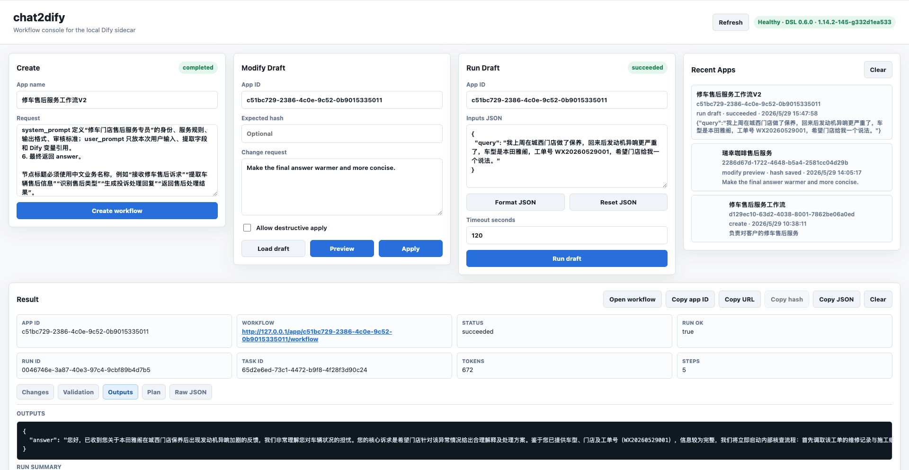
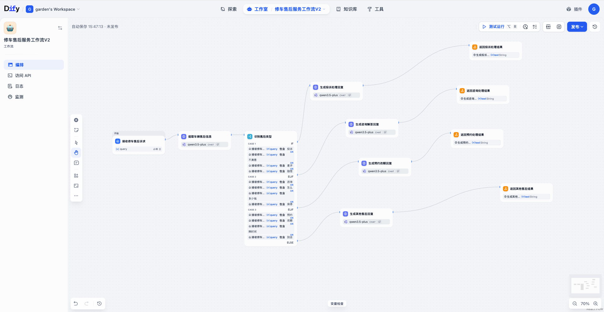

# chat2dify

chat2dify 是一个独立的 FastAPI sidecar，用自然语言创建、修改、测试运行和发布 Dify 应用。它不修改 Dify 源码，而是连接本地或局域网内的 Dify Console API，把用户意图转换成可审阅的 Plan IR 和 Dify DSL，再导入或写回 Dify 草稿。

当前 README 面向 `v1.0.0` 分支：文档结构参考 `v2.0.0`，但功能描述保持 v1 多面板 Web UI、直接工作流 API 和后台任务队列的边界。

## 当前版本

`v1.0.0` 的主要能力：

- 独立 sidecar：作为单独 FastAPI 服务运行，不侵入 Dify 仓库。
- 多面板 Web UI：创建、修改预览、应用修改、草稿运行、发布、资源选择各自有明确入口。
- Plan IR 流程：Planner 生成结构化计划后，会经过规范化、修复、校验、编译、反编译和本地 DSL 预检。
- 草稿安全写回：修改先预览，不直接写回；应用时支持 draft hash 校验和破坏性变更保护。
- 后台任务持久化：创建、修改、运行和发布可通过任务队列执行，浏览器刷新后仍可查询状态。
- 支持 Workflow 和 Chatflow 生成，也可创建基础 Chatbot、Agent、Completion 配置型应用。
- 支持 Dify 数据集、运行模型、工具、Agent Strategy 和 Trigger Provider 的只读选择。
- Planner 默认使用 NVIDIA NIM DeepSeek V4 Flash，也支持显式 OpenAI-compatible Planner。

## 截图

chat2dify v1 多面板 Web UI，可在同一工作台完成创建、修改、草稿运行和发布：



通过 chat2dify 生成的 Dify 工作流画布示例：



## 工作方式

典型创建流程如下：

```text
用户自然语言
  -> /api/workflows/draft 或 /api/tasks/workflows/create
  -> Planner 生成 Plan IR
  -> normalize / repair / validate
  -> 本地 DSL round-trip preflight
  -> /console/api/apps/imports
  -> 返回 Dify app_id、workflow_url、base_hash 和 DSL
```

典型修改流程如下：

```text
app_id + 修改要求
  -> 读取 Dify 草稿
  -> 反编译为 Plan IR
  -> Planner 生成修改后的 Plan IR
  -> validate / preflight
  -> 返回修改预览
  -> 用户确认后 apply
  -> 带 expected_hash 写回 Dify 草稿
```

普通创建和修改只操作 Dify 草稿，不会自动发布。发布需要显式调用发布接口，并建议携带当前草稿 hash。

## 系统架构

```text
Web UI / API client
  -> FastAPI sidecar
  -> Planner provider
  -> Plan IR normalizer / validator / compiler
  -> Dify Console API client
  -> Dify app draft / run / publish

DIFY_SOURCE_DIR
  -> 读取 Dify DSL 版本

SQLite task DB
  -> 记录后台任务状态、结果和错误详情
```

## 能做什么

### 创建应用

可以直接描述目标应用：

```text
创建一个电脑城售后服务工作流，用户描述电脑问题后，先安抚，再给排查步骤，最后生成专业售后回复。
```

Workflow 使用 `start -> ... -> end`，Chatflow 使用 `start -> ... -> answer`。Chatflow 会读取 `sys.query` 和 `sys.files`，并保留 Dify 的多轮对话语义。

### 修改草稿

可以基于现有 Dify 草稿生成修改预览：

```text
把回复改得更专业一点，先安抚用户，再给排查步骤。
```

推荐流程是：

```text
Load draft -> Preview -> Apply reviewed preview
```

默认安全模式会阻止大规模删除节点、重写入口/出口、广泛改线等高风险变更。确实需要破坏性重构时，API 可显式传 `allow_destructive=true`。

### 测试运行

创建或修改后，可以运行 Dify 草稿：

```text
运行这个工作流，输入：为什么台式机突然黑屏开不了机？
```

Workflow 通过 Draft Run 执行；Chatflow、Chatbot、Agent、Completion 使用各自的 draft run/chat API。Chatflow 下一轮需要传回上一轮返回的 `conversation_id` 和 `message_id`。

### 发布和触发器

发布必须显式执行，并建议带 `expected_hash`。Webhook、Schedule、Plugin Trigger 工作流需要发布后通过对应触发方式运行，不能用普通 Draft Run 代替。

Trigger Provider 和订阅只从 Dify 读取。chat2dify 不创建插件订阅，不写凭据，也不接受 Planner 猜测 provider ID。

### 资源选择

Web UI 和 API 可以读取并选择：

- Dify 数据集，用于 `knowledge-retrieval`。
- Dify 运行模型，用于生成到 LLM、Classifier、Extractor 和 Agent 节点。
- 已安装工具，用于 `tool` 节点。
- 已安装 Agent Strategy，用于 `agent` 节点。
- 已配置 Trigger Provider 和 Trigger Subscription，用于触发器工作流。

这些接口只读取 Dify 已安装、已配置的资源。chat2dify 不安装插件，不编辑凭据，也不允许 Planner 编造资源标识。

## 支持的应用类型

| Dify 类型 | `app_mode` | 说明 |
| --- | --- | --- |
| Workflow | `workflow` | 普通工作流，使用 `start -> ... -> end` |
| Chatflow | `advanced-chat` | 对话流，使用 `start -> ... -> answer`，支持多轮上下文 |
| Chatbot | `chat` | Dify 基础聊天助手配置 |
| Agent | `agent-chat` | Dify Agent 应用配置 |
| Completion | `completion` | 文本生成应用配置 |

## 安装

```bash
python3 -m venv .venv
source .venv/bin/activate
pip install -r requirements.txt
cp .env.example .env
```

chat2dify 默认假设 Dify 源码仓库在当前仓库的同级目录：

```text
../dify
../chat2dify
```

启动时会读取 `DIFY_SOURCE_DIR` 下的 `api/constants/dsl_version.py`，因此该目录必须存在。

## 配置

`.env` 从仓库根目录读取，真实环境变量会覆盖 `.env`。

最小可用配置：

```env
DIFY_SOURCE_DIR=../dify
DIFY_CONSOLE_API_BASE=http://127.0.0.1/console/api
DIFY_CONSOLE_WEB_BASE=http://127.0.0.1

DIFY_EMAIL=you@example.com
DIFY_PASSWORD=your-password
DIFY_LOGIN_LANGUAGE=en-US

DIFY_DEFAULT_MODEL_PROVIDER=langgenius/openai/openai
DIFY_DEFAULT_MODEL_NAME=gpt-4o-mini
DIFY_DEFAULT_DATASET_IDS=

PLANNER_DEFAULT_PROVIDER=nvidia
PLANNER_TIMEOUT_SECONDS=600
PLANNER_REQUEST_RETRIES=2
NVIDIA_API_KEY=nvapi-...
NVIDIA_BASE_URL=https://integrate.api.nvidia.com/v1
NVIDIA_MODEL=deepseek-ai/deepseek-v4-flash
NVIDIA_THINKING=false
NVIDIA_REASONING_EFFORT=low
NVIDIA_MAX_TOKENS=8192

OPENAI_API_KEY=
OPENAI_BASE_URL=https://api.openai.com/v1
OPENAI_MODEL=gpt-4o-mini

CHAT2DIFY_TASK_DB=data/tasks.sqlite3
CHAT2DIFY_TASK_WORKERS=2
```

重要配置说明：

- `DIFY_CONSOLE_API_BASE`：Dify Console API 地址。使用 Dify docker compose 时，通常走 nginx，即 `http://127.0.0.1/console/api`。
- `DIFY_CONSOLE_WEB_BASE`：返回给用户的 Dify 控制台链接前缀。
- `DIFY_EMAIL` / `DIFY_PASSWORD`：用于导入应用、读取草稿、运行草稿和发布。
- `DIFY_DEFAULT_MODEL_PROVIDER` / `DIFY_DEFAULT_MODEL_NAME`：生成到 Dify LLM 节点里的运行模型，不是 chat2dify Planner。
- `PLANNER_*`、`NVIDIA_*`、`OPENAI_*`：chat2dify 用来生成或修改 Plan IR 的规划模型。
- `DIFY_DEFAULT_DATASET_IDS`：可选，生成知识检索节点时使用的默认数据集 ID，多个 ID 用逗号分隔。
- `CHAT2DIFY_TASK_DB` / `CHAT2DIFY_TASK_WORKERS`：后台任务存储路径和并发 worker 数。

如果默认 Planner provider 没有配置 API key，创建草稿会退化为简单确定性模板；修改预览仍需要至少一个可用 Planner。

## 运行

```bash
uvicorn app.main:app --host 127.0.0.1 --port 8000
```

打开：

```text
http://127.0.0.1:8000/
```

健康检查：

```bash
curl http://127.0.0.1:8000/health
```

## Web UI 使用建议

创建时推荐把信息直接写完整：

```text
创建一个电脑城售后服务工作流。名称叫电脑城售后服务工作流。
用户输入售后问题后，先安抚，再给排查步骤，最后建议联系门店或维修服务。
```

修改时先加载当前草稿，再生成预览：

```text
把最终回复改得更简洁，先问电源和显示器，再问是否听到风扇声。
```

如果需要知识库、工具、Agent Strategy、模型或触发器，先在对应面板里选择 Dify 已配置的资源，再提交创建或修改请求。

## API 概览

主要工作流 API：

| 方法 | 路径 | 用途 |
| --- | --- | --- |
| `POST` | `/api/workflows/draft` | 只生成 DSL 和 Plan IR，不导入 Dify |
| `POST` | `/api/workflows/create` | 创建并导入 Dify 应用 |
| `GET` | `/api/workflows/{app_id}/draft` | 读取当前 Dify 草稿并反编译为 Plan IR |
| `POST` | `/api/workflows/modify/draft` | 生成修改预览 |
| `POST` | `/api/workflows/modify/apply` | 应用已审阅的修改 |
| `POST` | `/api/workflows/run/draft` | 运行 Workflow 草稿 |
| `POST` | `/api/chatflows/run/draft` | 运行 Chatflow 草稿 |
| `POST` | `/api/chatbots/run/draft` | 运行 Chatbot 草稿 |
| `POST` | `/api/completions/run/draft` | 运行 Completion 草稿 |
| `POST` | `/api/agents/run/draft` | 运行 Agent 草稿 |
| `POST` | `/api/workflows/{app_id}/publish` | 发布草稿 |
| `GET` | `/api/workflows/{app_id}/triggers` | 查看已发布触发器 |
| `GET` | `/api/workflows/{app_id}/triggers/webhook` | 查看 Webhook 触发地址 |
| `POST` | `/api/workflows/{app_id}/triggers/{trigger_id}/status` | 启用或禁用触发器 |

后台任务 API：

| 方法 | 路径 | 用途 |
| --- | --- | --- |
| `POST` | `/api/tasks/workflows/create` | 后台创建应用 |
| `POST` | `/api/tasks/workflows/modify/draft` | 后台生成修改预览 |
| `POST` | `/api/tasks/workflows/modify/apply` | 后台应用修改 |
| `POST` | `/api/tasks/workflows/run/draft` | 后台运行 Workflow 草稿 |
| `POST` | `/api/tasks/chatflows/run/draft` | 后台运行 Chatflow 草稿 |
| `POST` | `/api/tasks/chatbots/run/draft` | 后台运行 Chatbot 草稿 |
| `POST` | `/api/tasks/completions/run/draft` | 后台运行 Completion 草稿 |
| `POST` | `/api/tasks/agents/run/draft` | 后台运行 Agent 草稿 |
| `POST` | `/api/tasks/workflows/publish` | 后台发布草稿 |
| `GET` | `/api/tasks/{task_id}` | 查询后台任务 |
| `POST` | `/api/tasks/{task_id}/cancel` | 请求取消后台任务 |

资源选择 API：

```text
GET /api/planner/providers
GET /api/dify/datasets
GET /api/dify/models
GET /api/dify/tools
GET /api/dify/agent-strategies
GET /api/dify/trigger-providers
GET /api/dify/trigger-subscriptions
```

## 请求示例

创建 Workflow：

```bash
curl -X POST http://127.0.0.1:8000/api/workflows/create \
  -H 'Content-Type: application/json' \
  -d '{"message":"Summarize the user input","app_name":"Summary MVP"}'
```

创建 Chatflow：

```bash
curl -X POST http://127.0.0.1:8000/api/workflows/create \
  -H 'Content-Type: application/json' \
  -d '{
    "app_mode":"advanced-chat",
    "app_name":"汽车售后多轮客服",
    "message":"创建汽车售后多轮客服。识别客户问题，礼貌追问缺失信息，记住最近对话，并通过 Answer 回复。"
  }'
```

生成修改预览：

```bash
curl -X POST http://127.0.0.1:8000/api/workflows/modify/draft \
  -H 'Content-Type: application/json' \
  -d '{"app_id":"YOUR_APP_ID","message":"Make the final answer warmer"}'
```

应用修改：

```bash
curl -X POST http://127.0.0.1:8000/api/workflows/modify/apply \
  -H 'Content-Type: application/json' \
  -d '{"app_id":"YOUR_APP_ID","message":"Make the final answer warmer","expected_hash":"OPTIONAL_CURRENT_HASH"}'
```

运行 Workflow 草稿：

```bash
curl -X POST http://127.0.0.1:8000/api/workflows/run/draft \
  -H 'Content-Type: application/json' \
  -d '{"app_id":"YOUR_APP_ID","inputs":{"query":"我要投诉订单配送太慢"},"timeout_seconds":120}'
```

## Plan IR 和节点支持

Plan IR 是 chat2dify 的中间表示。Planner 只负责生成结构化计划；chat2dify 会执行规范化、修复、校验、编译、反编译和 Dify DSL 预检。

当前支持的主要节点：

```text
start, llm, code, if-else, end, answer, http-request,
template-transform, question-classifier, parameter-extractor,
variable-aggregator, document-extractor, list-operator,
knowledge-retrieval, human-input, iteration, loop, assigner,
tool, agent, trigger-webhook, trigger-plugin, trigger-schedule
```

范围说明：

- Workflow 使用 `end`，Chatflow 使用 `answer`。
- Chatflow 会读取 `sys.query` 和 `sys.files`，并保留 Dify 对话记忆语义。
- `knowledge-retrieval` 只能使用请求选择或环境变量配置的数据集 ID。
- `tool` 只能使用 Dify 已安装并由用户选择的工具。
- `agent` 只能使用 Dify 已安装并由用户选择的 Agent Strategy。
- Trigger 工作流必须显式选择 Webhook、Schedule 或 Plugin Trigger 元数据。
- `datasource`、`datasource-empty`、`knowledge-index` 等外部依赖节点以兼容读取和保留为主。
- 复杂旧草稿可以尽量读取和保留；超出支持范围的节点无法保证可生成新的同类节点。

Chatflow conversation variables 支持 `string`、`number`、`boolean`、`object`、`array[string]`、`array[number]`、`array[boolean]`、`array[object]`。顶层 `assigner` 可更新已声明的 conversation variables；删除、重命名或修改变量类型属于破坏性变更。

## 任务和错误处理

后台任务存储在 SQLite：

```env
CHAT2DIFY_TASK_DB=data/tasks.sqlite3
CHAT2DIFY_TASK_WORKERS=2
```

任务状态包括 `queued`、`running`、`succeeded`、`failed`、`cancelled`、`interrupted`。服务重启时未完成任务会标记为 `interrupted`。完成记录默认保留 7 天，最多保留 200 条。

取消、失败和中断的任务不会恢复正在执行的 LLM 或 Dify HTTP 请求。Web UI 的 Retry 会使用保存的请求从头启动一个新任务。

Planner 请求会按配置重试瞬时断连、超时、限流和临时上游错误。如果最终失败，API 会返回结构化错误详情，后台任务也会保存同一份 detail，便于 Web UI 展示失败阶段和原因。

## 开发

运行测试：

```bash
pytest
```

检查前端脚本语法：

```bash
node --check app/static/app.js
```

项目结构：

```text
app/
  main.py              FastAPI 路由、任务入口和 Dify 操作编排
  tasks.py             后台任务队列和 SQLite 存储
  agent/               Planner、编辑器、规范化、差异和保护逻辑
  compiler/            Plan IR 到 Dify DSL 的编译
  dify/                Dify Console API client、graph 适配和预检
  static/              v1 Web UI
tests/                 pytest 覆盖 create / modify / run / models / tasks
docs/images/           README 截图
```

## 注意事项

- chat2dify 是 sidecar，不是 Dify 插件，也不会修改 Dify 源码。
- 创建和修改默认只操作 Dify 草稿；发布需要显式确认。
- 浏览器端只保存工作台状态和任务结果，API key 保留在服务端。
- 运行 Dify docker compose 时，优先使用 nginx 暴露的 `/console/api` 地址，而不是容器内部的 `5001`。
- README 中的截图来自 v1 多面板 Web UI 和 Dify 生成结果。
