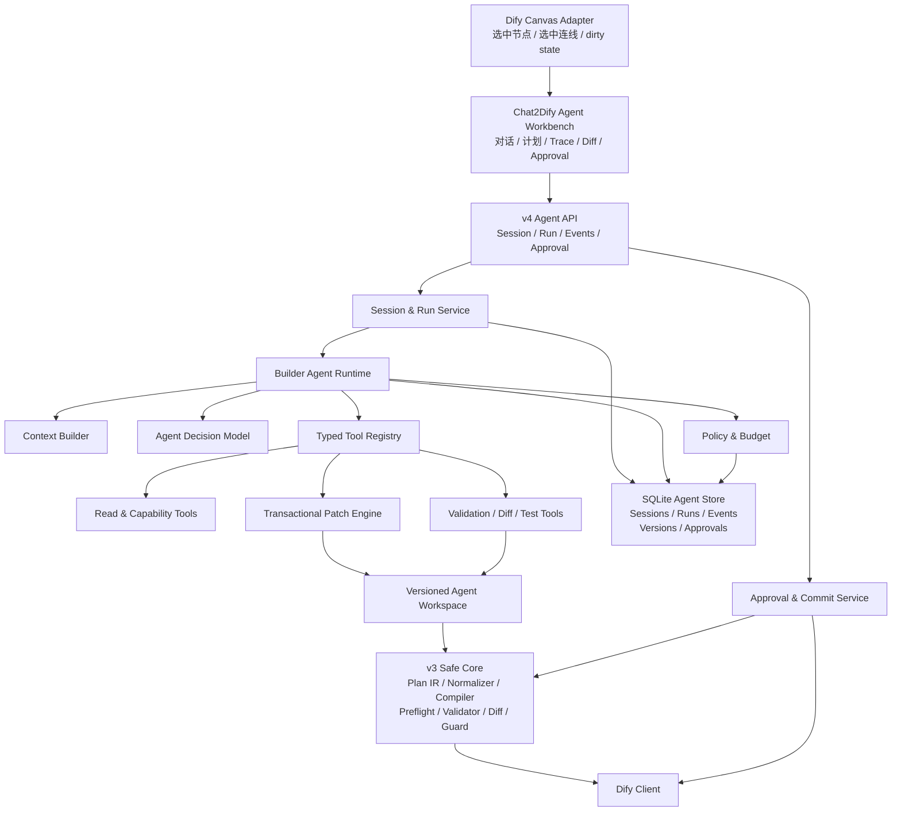
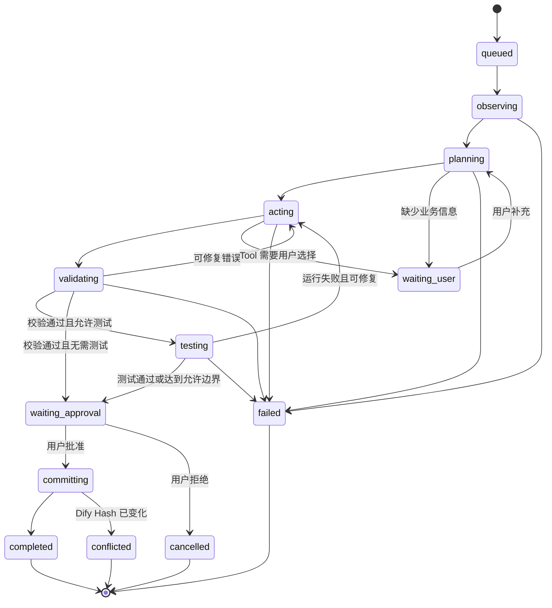

# Chat2Dify v4.0.0：AI Chat Agent 架构升级与实现方案

> - 状态：Proposed
> - 目标版本：v4.0.0
> - 方案范围：Chat2Dify Builder Agent，不是 Dify `agent-chat` 应用类型
> - 基线版本：v3.0.0，基于当前 `main` 分支代码审查
> - 参考讨论：[chat2dify-agent-upgrade-summary.md](https://github.com/Garden12138/whimsical-ideas/blob/main/chat2dify-agent-upgrade-summary.md)

## 1. 结论

v4.0.0 不应重写 v3 的 Plan IR、编译器、校验器、草稿 Hash 和变更保护，而应在这些确定性能力之前增加一个可观测、可暂停、可恢复的 Builder Agent Runtime。

目标闭环是：

```text
Observe → Plan → Act → Validate → Repair → Test → Review → Commit
```

其中：

- Agent 只能调用注册过的 Typed Tools。
- Agent 只修改服务端的版本化工作区，不能直接修改 Dify，也不能直接写原始 DSL。
- Tool 通过 Patch IR 修改 `WorkflowPlan`，每次修改都生成新的工作区版本。
- 每次变更后复用现有 normalize、compile、preflight、validator、diff、guard 链路。
- 写回 Dify 必须经过用户审批，并再次校验 `base_hash`。
- 发布不进入 v4.0.0 的自动闭环，继续作为独立的显式高风险操作。
- v4.0.0 采用一个主 Agent、结构化工具和确定性验证器，不引入多 Agent。

建议将产品能力命名为 **Chat2Dify Builder Agent**，避免与以下现有概念混淆：

- Dify `agent-chat` 应用；
- Workflow 中的 `agent` 节点；
- 当前 `app/agent/` 下的单次 Workflow Planner。

## 2. v3 基线与差距

### 2.1 可以直接复用的能力

当前代码已经具备成熟 Agent 最难补齐的一组安全内核：

| 现有能力 | 代码位置 | v4 用法 |
| --- | --- | --- |
| 自然语言操作入口 | `app/assistant.py` | 保留为 v3 兼容入口 |
| Workflow Plan IR | `app/models.py` | 继续作为规范化工作流模型 |
| 创建规划 | `app/agent/planner.py` | 保留，逐步转为创建工具或兼容路径 |
| 全量修改规划 | `app/agent/editor.py` | 保留兼容，v4 主链路改用 Patch IR |
| 规范化与引用修复 | `app/agent/normalizer.py`、`app/node_outputs.py` | Patch 应用后的确定性修复 |
| Plan/DSL 校验 | `app/validator.py`、`app/dify/preflight.py` | 每次变更后的验证层 |
| Plan Diff | `app/agent/diff.py` | Review、风险判断和 Undo 的基础 |
| 破坏性变更保护 | `app/agent/guard.py` | 审批策略的确定性输入 |
| Plan 到 Dify DSL/Graph | `app/compiler/`、`app/dify/graph.py` | 最终预览和写回 |
| 草稿 Hash 并发保护 | `app/main.py`、`app/dify/client.py` | Commit 前乐观锁 |
| Dify 资源目录 | `app/dify/client.py` | Capability Catalog 的动态来源 |
| 多类型运行 API | `app/main.py`、`app/dify/sse.py` | Test/Inspect 工具的底层实现 |
| SQLite 后台任务 | `app/tasks.py` | Agent Run 调度基础 |
| 内嵌面板 | `deploy/dify/web-adapter/` | 画布上下文和 Agent 工作台入口 |

当前修改链路已经是：

```text
Dify Draft Graph
  → decompile_dify_graph
  → WorkflowPlan
  → LLM 返回完整修订版 WorkflowPlan
  → normalize
  → preflight / validate
  → diff / guard
  → compile_plan_to_dify_graph(base_graph=...)
  → sync_draft_workflow(hash=...)
```

v4 应保留后半段，把“LLM 一次返回完整修订版”替换为“Agent 多轮调用 Patch Tool”。

### 2.2 当前限制

| 维度 | v3 现状 | v4 需要补齐 |
| --- | --- | --- |
| 意图 | 固定操作集合 | 面向目标的多步骤 Run |
| 规划 | 一次生成完整 Plan | 可更新的 Goal Plan |
| 编辑 | LLM 重写完整 Plan | 小粒度、带前置条件的 Patch IR |
| 上下文 | app ID、mode、name 等 | Snapshot、选中节点、资源能力、执行错误 |
| 工具 | 能力散落在函数/API 中 | 统一 Typed Tool Registry |
| 修复 | 单次规划最多语义重试 | 基于验证/运行观察的 Repair Loop |
| 过程反馈 | 任务当前 phase | Append-only Agent Event Trace |
| 持久化 | 一个任务保存一个最新状态 | Session、Run、Event、Workspace Version、Approval |
| 撤销 | 无一等模型 | 工作区回退和补偿式 Undo |
| UI | 轮询任务、展示原始 JSON | SSE 时间线、Goal Plan、业务 Diff、审批卡 |
| 画布上下文 | iframe URL 参数 | 安全的 `postMessage` 上下文通道 |
| 评测 | 单元/接口测试 | 固定 Agent 任务集与质量指标 |

### 2.3 v4.0.0 范围

首发主链路建议只覆盖：

- `workflow`
- `advanced-chat`

原因是这两类应用共享 `WorkflowPlan`、Graph、Diff、Guard 和草稿 Hash 链路，最适合先跑通完整 Agent 闭环。

以下类型继续走 v3 配置预览路径，并在后续引入独立的 `ConfigPatchIR`：

- `chat`
- `completion`
- `agent-chat`

不要强行让 Graph Patch IR 同时表达配置型应用，否则会把两个不同领域模型重新揉成无类型的 `dict`。

### 2.4 创建与修改

目标架构同时支持创建和修改，但建议按“先修改、后创建”的顺序实现：

- 修改从 Dify 当前草稿生成 `Workspace v0`，带 `app_id` 和 `base_hash`；
- 创建从服务端生成的最小合法脚手架生成 `Workspace v0`；
- Workflow 脚手架为 `start → end`；
- Chatflow 脚手架为 `start → answer`；
- Agent 通过事务 Patch 在脚手架中插入业务节点；
- 创建完成后的 Commit 复用现有 DSL Import，再读取新应用草稿 Hash；
- 修改完成后的 Commit 复用现有 `sync_draft_workflow(hash=...)`。

因此两条路径共享 Runtime、Tools、Workspace、Validation、Review 和 Approval，只有 Snapshot 初始化和最终 Commit Adapter 不同。首个开发切片先做修改，以最快验证并发与安全边界；v4.0.0 GA 前再接入创建 Adapter。若创建 Adapter 未达到发布门槛，现有 v3 创建入口继续可用，不能用未验证的 Agent 创建链路替换它。

## 3. 设计原则

### 3.1 模型负责判断，系统负责事实

模型可以：

- 分解目标；
- 选择工具；
- 提议 Patch；
- 根据结构化错误决定修复方向；
- 解释结果。

模型不可以：

- 直接生成并写入 Dify DSL；
- 自己生成最终节点 ID；
- 绕过 Pydantic Schema；
- 绕过校验、风险策略或 Hash；
- 读取 Credential 明文；
- 自主发布；
- 在没有批准的情况下执行高副作用 Draft Run。

### 3.2 Agent 工作区与 Dify 草稿隔离

修改型 Run 启动时读取 Dify 草稿并固定：

```text
app_id
app_mode
base_hash
base_plan
base_graph
capability_snapshot
```

创建型 Run 固定 `app_mode`、最小合法脚手架和 Capability Snapshot，`app_id`、`base_hash` 在导入成功后产生。

之后所有 Agent 编辑只发生在服务端工作区：

```text
Workspace v0 → Patch A → v1 → Patch B → v2 → Repair Patch → v3
```

只有用户批准 `v3` 后，Commit Service 才会：

1. 对最终 Plan 运行完整校验；
2. 运行 Guard 和审批范围检查；
3. 对修改型 Run 重新读取 Dify 当前 Hash 并比较 `base_hash`；
4. 对修改型 Run 编译带 `base_graph` 的 Dify Graph 并调用 `sync_draft_workflow`；
5. 对创建型 Run 编译 DSL 并调用现有 Import 链路；
6. 保存最终 `app_id`、新草稿 Hash 和 Commit 结果。

### 3.3 Patch 是事务，不是随意修改

一次 `workflow.patch` Tool Call 可以包含多个相关操作，但必须满足：

- 整批操作要么全部成功，要么全部失败；
- 每个操作可带前置条件；
- Patch 绑定 `workspace_version` 和 `expected_base_hash`；
- Patch 应用后必须能构造合法的 `WorkflowPlan`；
- 失败不会改变工作区 Head；
- Tool 返回结构化错误，不向 Agent 暴露内部堆栈。

### 3.4 审批属于执行层，不属于模型

Agent 可以返回 `approval_required` 决策，但不能自己批准，也不直接调用 Dify Commit。

最终写回由独立的 Approval/Commit Service 完成。这样即使 Prompt 被注入，模型也无法把“请忽略审批”变成真实权限。

## 4. 目标架构



### 4.1 模块职责

| 模块 | 职责 |
| --- | --- |
| Session & Run Service | 创建会话、提交目标、取消、恢复、查询状态 |
| Agent Runtime | 驱动 Observe/Plan/Act/Validate/Repair 循环 |
| Context Builder | 构造最小、可信、可控长度的模型上下文 |
| Agent Decision Model | 只输出 Tool Call、Ask User 或 Finish |
| Policy & Budget | 工具权限、审批、次数、Token、时间和副作用预算 |
| Tool Registry | 工具发现、输入校验、执行、输出清洗和审计 |
| Patch Engine | 事务性应用 Patch IR，生成新工作区版本 |
| Agent Workspace | 保存基线、Head、版本链、验证和测试结果 |
| Agent Store | Append-only Trace 和恢复检查点 |
| Approval & Commit | 独立执行用户批准后的 Dify 写回 |

## 5. Agent Runtime

### 5.1 Run 状态机



`waiting_user` 和 `waiting_approval` 必须是可持久化的暂停状态，不能依赖运行线程一直存活。

### 5.2 决策协议

模型每轮只允许返回以下三种决策：

```python
class ToolCallDecision(BaseModel):
    type: Literal["tool_call"]
    tool_name: str
    arguments: dict[str, Any]
    goal_step_id: str


class AskUserDecision(BaseModel):
    type: Literal["ask_user"]
    question: str
    missing: list[str]


class FinishDecision(BaseModel):
    type: Literal["finish"]
    summary: str
    evidence: list[str]
```

无论 Provider 是否原生支持 function calling，都在 Provider Adapter 后统一验证成这个协议。原生 Tool Call 可直接映射；不支持时使用严格 JSON Schema 输出。

### 5.3 核心循环

```python
while budget.can_continue():
    context = context_builder.build(run, workspace.head)
    decision = decision_model.decide(context, registry.visible_specs(context))
    trace.append("agent.decision", decision)

    if decision.type == "ask_user":
        run.pause_for_user(decision)
        break

    if decision.type == "finish":
        validation = validate_head()
        if validation.ok and goal_evaluator.accepts(decision, validation):
            run.request_review(workspace.head)
            break
        observations.add(validation.as_observation())
        continue

    authorization = policy.authorize(decision, run)
    if authorization.requires_approval:
        run.pause_for_approval(authorization)
        break

    result = registry.execute(decision.tool_name, decision.arguments)
    trace.append("tool.completed", result.public_view())
    observations.add(result.as_observation())

    if result.workspace_changed:
        validation = validate_head()
        observations.add(validation.as_observation())

    if loop_guard.same_error_repeated(2):
        run.fail("repeated_error")
        break
```

### 5.4 默认预算

建议默认值：

```text
max_iterations = 8
max_model_calls = 6
max_patch_operations = 50
max_test_runs = 3
max_same_error_retries = 2
max_run_seconds = 600
max_context_tokens = provider-specific
```

预算必须由服务端执行，模型不能自行提高。

达到预算后返回：

- 当前已完成步骤；
- 当前可审阅 Diff；
- 未完成原因；
- 最近结构化错误；
- “继续运行”入口，而不是静默无限重试。

## 6. 上下文模型

### 6.1 Builder Context

```python
class BuilderContext(BaseModel):
    goal: UserGoal
    goal_plan: GoalPlan
    app: AppReference
    workspace: WorkflowSummary
    selection: CanvasSelection | None
    capabilities: CapabilitySummary
    latest_validation: ValidationSummary | None
    latest_execution: ExecutionObservation | None
    recent_observations: list[Observation]
    constraints: RunConstraints
    budget: RemainingBudget
```

Context Builder 不应默认把完整 Raw Graph、全部 Dify 资源和完整 Trace 塞入每一轮 Prompt。

建议采用：

- 工作流整体摘要；
- 当前选中节点的一跳或两跳邻域；
- 与目标相关的节点详情；
- 资源搜索结果 Top K；
- 最近 N 条 Observation；
- 更早 Trace 的结构化摘要；
- 按需调用 `workflow.inspect` 获取细节。

### 6.2 信任边界

以下内容全部作为“不可信数据”处理，而不是指令：

- 节点 Prompt；
- Code Node 代码；
- HTTP 响应；
- Tool/Plugin 描述；
- Dataset 名称与文档内容；
- Dify 运行错误文本；
- 用户工作流中的注释。

模型 System Prompt 要明确标记数据边界；Tool Output 需要：

- 截断超长字段；
- 移除 Cookie、Authorization、API Key；
- 对 Credential 只返回可用性和引用 ID；
- 不返回环境变量值；
- 对运行输入输出提供脱敏摘要。

## 7. Goal Plan 与 Patch IR

### 7.1 Goal Plan

Goal Plan 描述“要完成什么”，允许在 Run 中调整：

```python
class GoalStep(BaseModel):
    id: str
    description: str
    status: Literal["pending", "in_progress", "completed", "blocked", "skipped"]
    depends_on: list[str] = []
    evidence: list[str] = []


class GoalPlan(BaseModel):
    goal: str
    assumptions: list[str] = []
    constraints: list[str] = []
    success_criteria: list[str]
    steps: list[GoalStep]
    revision: int = 1
```

Goal Plan 不是可执行脚本，不直接写入 Dify。

### 7.2 Patch IR

Patch IR 描述对当前工作区的确定性修改：

```python
class PatchDocument(BaseModel):
    workspace_version: str
    expected_base_hash: str
    operations: list[PatchOperation]
    rationale: str


class AddNode(BaseModel):
    op: Literal["node.add"]
    temp_ref: str
    node_type: NodeType
    title: str
    params: dict[str, Any]
    after_node_id: str | None = None


class UpdateNode(BaseModel):
    op: Literal["node.update"]
    node_id: str
    set: dict[str, Any]
    expected: dict[str, Any] | None = None


class RemoveNode(BaseModel):
    op: Literal["node.remove"]
    node_id: str
    expected_type: NodeType


class AddEdge(BaseModel):
    op: Literal["edge.add"]
    source: str
    source_handle: str = "source"
    target: str
    target_handle: str = "target"


class RemoveEdge(BaseModel):
    op: Literal["edge.remove"]
    source: str
    source_handle: str
    target: str
    target_handle: str
```

还需要一组显式的会话变量操作：

```text
conversation_variable.add
conversation_variable.update
conversation_variable.remove
```

不要在 v4.0.0 MVP 中开放任意 JSON Pointer Patch。显式 Operation Union 更容易：

- 做字段级权限控制；
- 识别破坏性操作；
- 生成 Reverse Patch；
- 形成稳定 Trace；
- 编写属性测试；
- 给模型提供小而准确的 Schema。

### 7.3 ID 与临时引用

- 模型使用 `temp_ref` 表示同一 Patch 中新增的节点。
- 服务端生成最终节点 ID。
- Patch Engine 在同一事务中解析 `temp_ref`。
- 现有节点必须按真实 ID 引用。
- 新 ID 生成规则集中在 Patch Engine，不复制 Normalizer 中的多套逻辑。

### 7.4 Patch 与全量 Graph 写回

Dify 最终仍可能要求提交完整 Graph，这不影响 Patch IR 的价值：

```text
Patch IR
  → apply to WorkflowPlan workspace
  → normalize and validate
  → compile_plan_to_dify_graph(base_graph=current_graph)
  → full graph sync with current hash
```

Patch IR 是 Agent 与确定性内核之间的边界，不是 Dify API 的传输格式。

### 7.5 配置型应用的独立 Config Patch 边界

Phase 4 的实现证据确认，Chatbot、Completion 和 Dify Agent 的权威状态是
`model_config`，不是 Graph。v4 因此新增独立的 `ConfigPatchDocument`，不扩展
Graph `PatchDocument`，也不允许两个 Operation Union 互相解析。

首个配置型应用范围为**修改现有应用**：

- `chat`
- `completion`
- `agent-chat`

新配置型应用继续使用 v3 创建入口。这样可以先复用已经存在的配置预览、运行和
创建行为，而不把未经独立验收的创建 Adapter 放进 v4 Runtime。

`ConfigPatchDocument` 显式支持：

```text
config.prompt.set
config.model.set
config.experience.set
config.agent.set
```

每个操作只能写固定领域字段，可带字段级前置条件，并产生低、中、高风险。模型
不能传 JSON Pointer 或任意配置路径。`config.agent.set` 写 Tool 绑定属于高风险，
必须先通过破坏性变更审批。

配置型 Snapshot 固定完整 `model_config`、应用类型、Dify/DSL 版本和
`base_hash`。Hash 优先使用 Dify 返回的 `hash`、`updated_at` 或 `version`；
若上游未提供这些字段，服务端对完整配置做规范化 SHA-256 指纹。Commit 前立即
重新读取配置并比较同一规则产生的 Hash/指纹，冲突时不调用
`update_model_config`。Commit 仍不作为模型 Tool。

## 8. Typed Tool Registry

### 8.1 Tool 契约

```python
class ToolSpec(BaseModel):
    name: str
    version: str
    description: str
    side_effect: Literal["none", "workspace", "draft_run", "dify_write"]
    approval: Literal["never", "policy", "always"]
    input_schema: dict[str, Any]
    output_schema: dict[str, Any]


class ToolResult(BaseModel):
    call_id: str
    ok: bool
    observation: dict[str, Any]
    error: ToolError | None = None
    workspace_version: str | None = None
```

Registry 统一负责：

- Tool 名称和版本；
- Pydantic 输入输出校验；
- Run/Session 作用域；
- 超时和取消；
- Policy 检查；
- Trace 记录；
- 输出脱敏；
- 幂等键；
- 稳定错误码。

### 8.2 MVP 暴露给模型的工具

首发建议限制为 8 个：

| Tool | 作用 | 副作用 |
| --- | --- | --- |
| `workflow.inspect` | 按节点、邻域、变量或摘要读取工作区 | 无 |
| `capability.search` | 搜索节点、模型、数据集、工具、Agent Strategy、Trigger | 无 |
| `node.schema.get` | 读取节点输入、参数、输出和 app mode 约束 | 无 |
| `workflow.patch` | 事务性应用一组 Patch Operation | 仅工作区 |
| `workflow.validate` | 运行分层校验 | 无 |
| `workflow.diff` | 返回业务 Diff、技术 Diff 和风险摘要 | 无 |
| `workflow.test_draft` | 用批准的输入运行草稿 | Dify 运行副作用 |
| `execution.inspect` | 定位失败节点并生成结构化 Observation | 无 |

Commit 不作为模型 Tool 暴露。Agent 完成后只生成 Review/Approval Request，用户批准后由 Commit Service 执行。

### 8.3 后续工具

```text
workflow.generate_test_input
workflow.undo_workspace
workflow.create_compensating_preview
docs.search
skill.search
skill.apply
environment_variable.list
credential.availability
```

Credential 明文读取不应成为 Tool。

### 8.4 Skill Registry

Phase 4 的 Skill 是服务端版本化元数据，不是新的执行权限。每个 Skill 声明：

- 适用 app mode；
- 按 app mode 区分的 required Tools；
- 确定性验证规则；
- 常见稳定错误；
- 示例与安全说明。

`skill.search` 只返回当前 app mode 和服务端 Policy 已可见 Tool 能满足的 Skill。
Skill 加载不会注册 Tool、修改 `ToolSpec.side_effect`、创建 Approval 或扩大
`visible_specs`。初始 Skill 为错误处理、人工兜底、JSON 输出、文件上传/文档
提取和知识检索。

## 9. Capability Catalog

当前资源能力已经分散存在：

- `NodeType` 和各类 Normalizer；
- `app/node_outputs.py`；
- `app/validator.py` 的节点配置规则；
- Dify Client 的 dataset/model/tool/agent strategy/trigger 列表。

v4 需要一个统一的只读目录：

```python
class NodeDefinition(BaseModel):
    type: NodeType
    supported_app_modes: set[AppMode]
    summary: str
    config_schema: dict[str, Any]
    output_schema: dict[str, Any]
    side_effect: str
    examples: list[dict[str, Any]]
    dify_version_range: str | None
```

实施建议：

1. 先以代码内静态定义覆盖 MVP 节点；
2. 复用 `node_outputs.py` 生成输出目录；
3. 将 Validator/Normalizer 中的节点规则逐步迁入定义；
4. 动态资源仍从 Dify API 读取；
5. Catalog Snapshot 固定到 Run，避免同一 Run 中资源列表漂移；
6. 缓存必须按 Dify 版本、Tenant 和用户配置隔离。

不要让 Agent 依赖一个持续增长的 System Prompt 记住所有节点参数。

## 10. 分层验证与 Repair

### 10.1 验证顺序

每次 `workflow.patch` 后运行：

1. Patch Schema 和前置条件；
2. `WorkflowPlan.model_validate`；
3. `normalize_plan_payload` 和引用修复；
4. Graph 结构、可达性和容器校验；
5. 节点参数、变量类型和输出引用校验；
6. 资源绑定和运行模型校验；
7. Plan → DSL 编译和 DSL 校验；
8. Diff 与 Change Guard；
9. 可选 Draft Run。

### 10.2 结构化错误

Repair Loop 只消费稳定错误：

```python
class AgentValidationIssue(BaseModel):
    code: str
    severity: Literal["warning", "error"]
    node_id: str | None
    field: str | None
    message: str
    expected: Any | None
    actual: Any | None
    repair_hint: str | None
    retryable: bool
```

对同一个 `code + node_id + field` 最多自动修复两次。之后暂停并展示：

- 已尝试的 Patch；
- 为什么没有解决；
- 当前工作区 Diff；
- 需要用户提供的信息。

### 10.3 运行错误观察

`execution.inspect` 应把 Dify SSE/执行结果归一化为：

```python
class ExecutionObservation(BaseModel):
    status: Literal["succeeded", "failed", "timeout", "cancelled"]
    failed_node_id: str | None
    failed_node_type: str | None
    error_code: str | None
    message: str | None
    upstream_summary: dict[str, Any]
    output_summary: dict[str, Any]
    retryable: bool
```

不要把整段未清洗的 SSE、模型思维过程或可能包含秘密的输入输出直接回填给 Planner。

### 10.4 测试输入

优先用确定性规则生成最小输入：

- `text` / `paragraph`：短占位业务文本；
- `number`：边界内普通值；
- `boolean`：默认 `true`；
- `json`：按 Schema 生成最小对象；
- `file` / `file-list`：必须由用户提供或使用明确测试 Fixture；
- Chatflow 使用 `sys.query` 语义。

LLM 只负责在确定 Schema 后生成更贴近目标的样例值。

### 10.5 候选工作区执行边界

实现核对 Dify `1.14.2` Console API 后确认：

- Workflow Draft Run 请求只接受 `inputs` 和 `files`；
- Chatflow Draft Run 请求只接受 `query`、`inputs`、`files` 和会话标识；
- 两个接口都不接受候选 Graph 或 DSL，实际运行的是 Dify 已持久化草稿。

因此 Phase 3 使用显式 `DraftExecutionAdapter` 边界：

- 支持隔离候选执行的 Adapter 可以运行当前 Workspace Head，并参与完整
  Test → Inspect → Repair → Re-test 闭环；
- 内置 Dify `1.14.2` Adapter 只在 Workspace 与固定的持久化基线一致时运行；
- Workspace 发生 Patch 后，内置 Adapter 返回稳定的
  `DRAFT_TEST_CANDIDATE_GRAPH_UNSUPPORTED`，不能把旧草稿结果误标为新版本测试；
- 不通过临时同步目标草稿、临时导入/删除应用或绕过 Commit Approval 来模拟
  候选执行，因为这些方案会引入未建模的 Dify 写入、Hash 漂移和恢复风险；
- 对当前内置 Adapter，修复后的真实运行验证需要先走现有 Review → Commit
  审批链，再由一个新的显式 Run 测试已提交草稿。

默认确定性验收使用支持候选 Workspace 的 Fake Adapter 验证完整修复循环；真实
Dify Adapter 仍验证审批、输入、Hash、脱敏、超时、取消和预算边界，并对不支持
的候选执行 fail closed。若后续 Dify 提供候选 Graph 执行 API，只替换 Adapter，
不扩大模型 Tool 权限。

## 11. 权限、审批与副作用

### 11.1 默认策略

| 操作 | 默认策略 |
| --- | --- |
| 读取工作流、资源搜索、Schema 查询 | 自动 |
| 工作区 Patch、Validate、Diff | 自动 |
| 无外部副作用的本地分析 | 自动 |
| Draft Run | 默认每个 Session 批准一次，并限制次数 |
| 包含 HTTP、Tool、人工通知等节点的 Draft Run | 每次批准或明确授予本次 Run 配额 |
| 写回 Dify 草稿 | 最终版本逐次批准 |
| 破坏性修改 | 独立明确批准，不能被普通“应用”覆盖 |
| 修改环境变量或 Credential 引用 | v4.0.0 默认不支持自动写 |
| 发布 | 始终单独批准，不在自动 Agent 闭环 |

即使 Draft Run 没有修改 Graph，也可能调用模型、HTTP、Tool 或通知系统，因此不能一律视为只读。

### 11.2 Approval Scope

Approval 需要绑定：

```text
run_id
workspace_version
base_hash
action
risk
allowed_test_runs
expires_at
```

工作区版本变化后，旧的 Commit Approval 自动失效。

### 11.3 Prompt Injection 防护

- Tool 可见性由服务端 Policy 决定，不由 Prompt 决定；
- 写入 Tool 与只读 Tool 分级；
- 所有 Tool 参数重新校验；
- 不把秘密放入模型 Context；
- Tool Metadata 作为数据引用；
- Commit 必须有用户产生的 Approval Record；
- Approval API 校验 Session 所有权、版本和过期时间；
- Trace 对敏感字段做持久化前脱敏。

## 12. 持久化、Trace 与恢复

### 12.1 数据表

建议在现有 SQLite 基础上新增独立表，不把全部 Agent 数据塞入 `workflow_tasks.result_json`：

```text
agent_sessions
  id, app_id, app_mode, status, created_at, updated_at

agent_runs
  id, session_id, task_id, goal, status, phase,
  base_hash, head_version_id, iteration,
  budget_json, error_json, created_at, updated_at, finished_at

agent_events
  id, run_id, seq, event_type, payload_json, created_at
  UNIQUE(run_id, seq)

agent_workspace_versions
  id, run_id, parent_id, base_hash,
  patch_json, reverse_patch_json, snapshot_json,
  validation_json, test_result_json, created_at

agent_approvals
  id, run_id, workspace_version_id, action,
  scope_json, status, expires_at, created_at, resolved_at
```

MVP 可保存每个版本的完整 `WorkflowPlan` JSON。后续数据量增长时再改成“周期快照 + Patch 链”，不要在首版过早优化。

### 12.2 Event Envelope

```json
{
  "id": "event-id",
  "seq": 17,
  "run_id": "run-id",
  "type": "validation.failed",
  "timestamp": "2026-07-25T12:00:00Z",
  "phase": "validating",
  "message": "发现 1 个变量引用错误，准备修复。",
  "data": {
    "issue_codes": ["PLAN_VARIABLE_REFERENCE_UNKNOWN"]
  }
}
```

事件类型至少包括：

```text
agent.started
context.loaded
goal_plan.created
goal_plan.updated
agent.decision
tool.started
tool.completed
workspace.version.created
validation.started
validation.failed
validation.passed
repair.started
test.approval_required
test.started
test.completed
review.ready
approval.required
approval.resolved
commit.started
commit.completed
agent.paused
agent.completed
agent.failed
```

### 12.3 恢复语义

服务重启后：

- 当前线程任务可标记 `interrupted`；
- Run、Event 和 Workspace Head 仍然可查询；
- 用户可以从最后一个成功工作区版本显式恢复；
- 不自动重放正在执行的 Dify Run 或 Commit；
- Commit 使用幂等键和 Hash，防止重启后重复写；
- 如果 Dify Hash 已变化，进入 `conflicted`，重新观察后生成新的 Preview。

### 12.4 Undo

区分两类 Undo：

- 写回前：直接把 Workspace Head 切回父版本；
- 写回后：根据 Reverse Patch 生成一个补偿式 Preview，再经过 Hash 校验和用户批准。

不要把写回后的 Undo 实现成无条件覆盖，因为用户可能已经在 Dify 画布中做了新的修改。

## 13. API 设计

v3 API 保留，v4 新增版本化路径：

```text
POST /api/v4/agent/sessions
POST /api/v4/agent/sessions/{session_id}/messages
GET  /api/v4/agent/sessions/{session_id}

GET  /api/v4/agent/runs/{run_id}
GET  /api/v4/agent/runs/{run_id}/events
POST /api/v4/agent/runs/{run_id}/cancel
POST /api/v4/agent/runs/{run_id}/resume

GET  /api/v4/agent/runs/{run_id}/diff
POST /api/v4/agent/runs/{run_id}/approvals/{approval_id}
POST /api/v4/agent/runs/{run_id}/commit
```

### 13.1 提交目标

```json
{
  "message": "在选中的分类节点后增加低置信度人工兜底，并保持其他分支不变。",
  "context": {
    "app_id": "app-id",
    "app_mode": "workflow",
    "selected_node_ids": ["classifier-1"],
    "selected_edge_ids": [],
    "canvas_draft_hash": "hash",
    "dirty_state": false
  },
  "constraints": {
    "allow_draft_test": false,
    "allow_destructive": false
  }
}
```

返回 `202 Accepted` 和 `run_id`。客户端随后通过 SSE 订阅事件。

### 13.2 SSE

`GET /events` 支持：

- `Last-Event-ID`；
- 心跳；
- 断线续传；
- 终态事件；
- 严格递增的 `seq`；
- 对同一 Run 的事件去重。

轮询接口继续保留为兼容和降级方案。

### 13.3 Commit

Commit Request 不接受客户端重新提交任意 Plan，只接受：

```json
{
  "workspace_version_id": "version-id",
  "approval_id": "approval-id"
}
```

服务端从持久化工作区读取最终 Plan，避免批准的是 A、客户端实际提交的是 B。

## 14. Dify 画布与前端工作台

### 14.1 画布上下文通道

当前面板只传：

```text
app_id
app_mode
app_name
```

v4 增加宿主页面与 iframe 的 `postMessage` 握手：

```text
chat2dify.ready
dify.context.init
dify.selection.changed
dify.draft.changed
chat2dify.context.refresh
```

上下文包括：

```text
selected_node_ids
selected_edge_ids
viewport
current_panel
dirty_state
canvas_draft_hash
context_nonce
```

安全要求：

- 校验 `event.origin`；
- 校验一次性 `context_nonce`；
- 不接受 iframe 传入的 Raw Graph 作为权威数据；
- Graph 仍由 Sidecar 从 Dify API 读取；
- `dirty_state=true` 或 Hash 不一致时阻止 Commit，并要求先同步画布。

### 14.2 Agent 工作台

建议拆成四个区域：

1. 对话与用户补充；
2. Goal Plan 和实时 Trace；
3. 业务 Diff、节点 Diff、Plan/DSL 技术视图；
4. Approval、运行结果、Undo/Resume。

默认展示业务语言：

```text
✓ 已读取当前 Workflow：9 个节点、11 条连接
✓ 已定位选中的分类节点
✓ 已新增低置信度分支
✗ Answer 引用了旧变量
✓ 已修复变量引用
✓ 结构与资源校验通过
```

Tool 原始参数、完整 Plan 和 DSL 放在折叠的技术视图中。

## 15. 建议代码结构

不移动现有文件，先增量增加：

```text
app/
├── agent/
│   ├── runtime.py            # Agent 主循环
│   ├── state.py              # Session/Run/Decision/GoalPlan 模型
│   ├── context.py            # Context Builder
│   ├── decision.py           # Provider 无关的决策接口
│   ├── policy.py             # Tool 权限、审批和预算
│   ├── registry.py           # Typed Tool Registry
│   ├── store.py              # Agent SQLite Store
│   ├── trace.py              # Event 生成与脱敏
│   ├── workspace.py          # 版本化工作区
│   ├── patch.py              # Patch IR 与事务执行
│   ├── catalog.py            # Node/Resource Capability Catalog
│   ├── execution.py          # 运行结果归一化
│   ├── tools/
│   │   ├── base.py
│   │   ├── workflow_read.py
│   │   ├── capability.py
│   │   ├── workflow_patch.py
│   │   ├── validation.py
│   │   ├── diff.py
│   │   └── draft_run.py
│   └── prompts/
│       ├── builder_system.md
│       ├── goal_plan.md
│       └── repair.md
│
├── api/
│   └── agent_v4.py
│
└── evals/
    ├── cases/
    ├── runner.py
    ├── graders.py
    └── reports/
```

现有模块继续承担：

```text
app/assistant.py             # v3 兼容操作路由
app/agent/planner.py         # v3 创建规划
app/agent/editor.py          # v3 全量修改预览
app/agent/normalizer.py      # 规范化
app/agent/diff.py            # Diff
app/agent/guard.py           # 风险保护
app/compiler/                # DSL/Graph 编译
app/dify/                    # Dify API 与 Graph Adapter
app/tasks.py                 # 后台执行器
```

当 v4 稳定后，再决定是否把 v3 Planner 封装成兼容 Tool，不在 v4.0.0 期间进行大规模文件搬迁。

## 16. 分阶段实施

### Phase 0：架构地基

目标：建立不会影响 v3 行为的 v4 骨架。

交付：

- `CHAT2DIFY_AGENT_V4_ENABLED` Feature Flag；
- Agent Session/Run/Event/Workspace/Approval 模型；
- SQLite Store 和迁移测试；
- Tool Registry 基础接口；
- Node Capability Catalog MVP；
- Patch IR Schema；
- API 空骨架和 SSE Event Envelope。

验收：

- Feature Flag 关闭时 v3 全部测试不变；
- Run/Event 可持久化并支持断线续读；
- 非法 Tool/Patch 在执行前被 Schema 拒绝。

### Phase 1：Observe → Patch → Validate → Review

目标：跑通不写 Dify 的 Agent 修改闭环。

交付：

- Workflow Snapshot；
- Context Builder；
- Goal Plan；
- `workflow.inspect`、`capability.search`、`node.schema.get`；
- Transactional Patch Engine；
- `workflow.patch`、`workflow.validate`、`workflow.diff`；
- Runtime 循环和预算；
- Review Ready 状态；
- Commit Approval 与 Hash 冲突处理。

验收场景：

> 在当前 Workflow 中增加一个分类分支，并保持原有其他节点不变。

必须满足：

- Agent 自己读取工作流；
- 只修改相关节点和连线；
- 产生 Patch Trace；
- 生成业务 Diff；
- 未批准前 Dify 草稿不变；
- 批准后通过现有安全链路写回。

这是 v4.0.0 最小可发布闭环。

在这条修改链路稳定后，增加同阶段的创建 Adapter：

- 从 `start → end` 或 `start → answer` 脚手架开始；
- 复用同一 Patch/Validate/Review 流程；
- Approval 后调用现有 DSL Import；
- 导入成功后读取并保存 `app_id` 和草稿 Hash；
- 创建失败时保留工作区和 Trace，允许修复后重新审批，不重复导入已成功的应用。

### Phase 2：上下文和 Agent 工作台

目标：达到可解释、可继续编辑的交互体验。

交付：

- Canvas `postMessage` 协议；
- 选中节点/连线上下文；
- SSE Timeline；
- Goal Plan UI；
- 节点级 Diff；
- 工作区 Undo；
- Run Pause/Resume；
- 用户补充信息后继续原 Run。

验收场景：

> 把选中的 LLM 节点 Prompt 改得更专业，并增加 JSON 输出约束。

### Phase 3：Test → Inspect → Repair

目标：根据运行结果自动修复。

交付：

- Draft Run Approval；
- 最小测试输入生成；
- `workflow.test_draft`；
- `execution.inspect`；
- 运行错误分类；
- Repair Loop；
- 测试次数、相同错误次数和成本限制。

验收场景：

> 运行当前工作流，并修复变量引用错误，直到能够正常返回结果。

### Phase 4：配置型应用、Skills 和评测扩展

交付：

- `ConfigPatchIR`；
- Chatbot、Completion、Dify Agent 配置型应用工具；
- Skill Registry；
- 常用 Skill：错误处理、人工兜底、JSON 输出、文件上传、知识检索；
- 固定评测集和回归报告；
- Dify 版本兼容矩阵。

该阶段可以作为 v4.x 持续演进，不阻塞 v4.0.0 首发。

## 17. 建议 Epic 拆分

| Epic | 主要内容 | 主要文件 |
| --- | --- | --- |
| E1 Agent Domain | State、Decision、Goal Plan、Budget | `app/agent/state.py` |
| E2 Persistence | Session、Run、Event、Version、Approval | `app/agent/store.py` |
| E3 Patch Engine | Patch IR、事务、Reverse Patch、属性测试 | `app/agent/patch.py` |
| E4 Capability | Node Schema、动态 Dify 资源搜索 | `app/agent/catalog.py` |
| E5 Tools | Registry 和 8 个 MVP Tool | `app/agent/tools/` |
| E6 Runtime | Observe/Plan/Act/Validate/Repair | `app/agent/runtime.py` |
| E7 API | v4 REST、SSE、Approval、Commit | `app/api/agent_v4.py` |
| E8 Workbench | Trace、Diff、Approval、Resume | `app/static/`、web adapter |
| E9 Draft Repair | Test、Execution Observation、Repair | `app/agent/execution.py` |
| E10 Evals | Cases、Graders、CI Report | `app/evals/`、`tests/` |

建议先完成 E1–E7 的纵向薄切，不要先把所有节点 Schema 重构完再接 Runtime。

## 18. 测试与评测

### 18.1 确定性测试

必须覆盖：

- Patch Operation Schema；
- 事务回滚；
- `temp_ref` 解析和服务端 ID；
- Patch 前置条件冲突；
- Reverse Patch；
- 每类 Patch 后的 Plan/DSL 校验；
- Hash 冲突；
- Approval 绑定错误版本；
- Approval 过期；
- Tool Policy；
- Tool Output 脱敏；
- Run 取消和恢复；
- SSE 断线续传与事件去重；
- 服务重启后的 Interrupted 状态；
- Prompt Injection 不能提升 Tool 权限；
- Draft Run 副作用审批；
- v3 API 回归。

Patch Engine 建议加入属性测试：

```text
apply(reverse(apply(plan, patch))) == canonical(plan)
failed_patch_does_not_change_head
commit_requires_validated_head
approval_for_vN_cannot_commit_vN+1
```

### 18.2 Agent 评测任务

固定真实任务：

```text
创建售后分析 Workflow
给已有 Workflow 增加分类分支
给 Chatflow 增加会话变量
修复失效变量引用
替换模型 Provider
增加知识库检索
增加错误处理分支
增加人工兜底
增加文件解析
从运行错误中恢复
```

每个 Case 固定：

- 输入 Snapshot；
- 用户目标；
- 允许资源；
- 期望不变量；
- 必须出现/禁止出现的变更；
- Validation 结果；
- 最大 Tool Call 数；
- 是否允许 Draft Run；
- 最终 Grader。

### 18.3 发布门槛

建议 v4.0.0 至少满足：

- 未审批写回次数：0；
- Hash 冲突下错误覆盖次数：0；
- 评测集最终 Plan/DSL 有效率：100%；
- 目标任务完成率：≥ 80%；
- 无关节点保持率：≥ 95%；
- 可修复验证错误自动修复率：≥ 60%；
- 所有失败 Run 都有可读 Trace 和结构化终止原因；
- v3 现有测试全部通过。

“最终 Plan/DSL 有效率 100%”是指无效结果不能进入 Review/Commit，不代表模型每次首轮都成功。

### 18.4 Phase 4 离线评测执行决策

默认发布评测使用版本化 JSON Case 和确定性 Fixture Replay，不调用真实 Provider
或 Dify。每个 Case 固定 Goal、Snapshot 版本、允许能力/资源、不变量、
必须/禁止变更、预算、副作用策略、预期验证、Trace 和终止原因。Runner 按 Case
ID 排序并生成无时间戳、键顺序固定的机器可读报告，因此同一版本输入可逐字节
复现。

Live-provider 评测通过 `EvaluationExecutor` 边界注入，并要求显式
`allow_live_provider=True`。默认 CI 不会因为存在 Provider 配置而自动切换成
Live 模式。

Phase 4 固定集保留一个预期失败：文件提取 Case 在没有用户文件或批准 Fixture
时以 `DRAFT_TEST_FILE_REQUIRED` 终止。它验证系统不会伪造用户文件，同时仍满足
目标完成率门槛；该失败必须包含可读 Trace 和结构化终止原因。

### 18.5 Dify 兼容矩阵

Capability 和可变更行为按 Run Snapshot 固定到 Dify/DSL 兼容决策。v4.0.0 的
生产支持矩阵为 Dify `1.14.x`（实际验收 `1.14.2`）和 App DSL `0.6.0`。
未知组合保留有界 Inspect/Validate 诊断，但 Graph/Config Patch 和 Commit
返回 `DIFY_VERSION_MUTATION_UNSUPPORTED`。仓库中的 `test` / `9.9.9` 规则只用于
确定性测试，不属于生产兼容声明。

## 19. 风险与对策

| 风险 | 影响 | 对策 |
| --- | --- | --- |
| 模型循环或成本失控 | 延迟、费用 | 服务端预算、相同错误熔断、可暂停 |
| Patch 仍破坏无关节点 | 用户信任 | 前置条件、最小 Diff、不变量 Grader、Guard |
| Dify 版本漂移 | Schema/编译失败 | Capability 按版本、现有 version/preflight、兼容矩阵 |
| 画布与 Sidecar 状态不一致 | 覆盖用户修改 | dirty state、Hash、Commit 前重新读取 |
| Draft Run 触发外部副作用 | 邮件/API/费用 | Node 副作用分类、测试审批、次数配额 |
| Prompt Injection | 越权或泄密 | Tool Policy、数据边界、脱敏、独立 Approval |
| SQLite 写竞争 | Trace 丢失或锁等待 | WAL、短事务、单 Run 顺序写、Store 抽象 |
| Trace 过大 | 存储和上下文膨胀 | Event 与模型 Context 分离、摘要和保留策略 |
| 自动恢复重复执行 | 重复写或重复调用 | 不自动重放副作用、幂等键、显式 Resume |
| 过早重构 v3 | 交付风险 | 新增 v4 路径、Feature Flag、纵向薄切 |

## 20. v4.0.0 推荐冻结范围

为了让首版可控，建议明确不做：

- 多 Agent；
- 自主发布；
- Credential 明文读取或自动创建；
- 自动写环境变量；
- 任意文档联网搜索；
- 自动拆分子工作流；
- 所有 Dify 节点一次性全覆盖；
- 服务重启后自动重放副作用 Tool；
- 用向量数据库替代结构化 Session/Run Store。

v4.0.0 必须做：

- 一个主 Builder Agent；
- Typed Tool Registry；
- Versioned Workspace；
- Patch IR；
- 分层 Validate；
- 持久化 Trace；
- Review/Approval/Hash Commit；
- 画布选中上下文；
- 基础 Repair；
- 可量化评测。

## 21. 首个可开发切片

建议第一条端到端 PR 只实现：

```text
POST 一个 Workflow 修改目标
  → 创建 Agent Run
  → 读取 Dify Snapshot
  → 生成一个 Goal Plan
  → 调用 workflow.inspect
  → 调用一次 workflow.patch
  → 运行 workflow.validate
  → 生成 workflow.diff
  → 进入 review.ready
  → 用户 Approval
  → Hash 校验后 Commit
```

仅支持以下 Patch：

```text
node.add
node.update
edge.add
edge.remove
```

仅支持以下节点：

```text
llm
if-else
end
answer
```

先用这个薄切验证 Session、Runtime、Tool、Workspace、Validation、Trace、Approval、Commit 的所有边界，再扩展节点和 Repair。它比先建设一个庞大的“全节点 Tool Catalog”更快暴露真正的架构问题。

## 22. Definition of Done

v4.0.0 可以宣布完成时：

- 用户能通过同一 Agent Runtime 创建新的 Workflow/Chatflow，或修改现有应用；
- 用户能在 Dify 画布中选中节点并用自然语言提出多步骤修改；
- Agent 能读取当前工作流和相关能力，而不是仅依赖 Prompt 记忆；
- Agent 能通过 Typed Tools 产生多个版本化 Patch；
- Agent 能根据结构化验证错误至少完成一轮自动修复；
- UI 能实时展示 Goal Plan、Tool Trace、Validation 和业务 Diff；
- 未批准前 Dify 草稿没有变化；
- 批准时严格绑定工作区版本和 Dify Hash；
- Hash 冲突不会覆盖 Dify 中的新修改；
- 用户可以取消、暂停、恢复和撤销未提交工作区修改；
- 所有终态都有持久化、可审计的 Trace；
- v3 创建、修改、运行、发布入口继续可用；
- 固定评测集达到发布门槛。

---

这次升级的关键不是让模型拥有更多直接权限，而是把现有安全内核包装成一组可观察、可组合、可验证的能力。只要先跑通 `Observe → Patch → Validate → Review → Commit`，Chat2Dify 就会从一次性 Workflow Copilot 进入真正的 Builder Agent 阶段；测试和自动修复可以在这个边界稳定后继续扩展。
