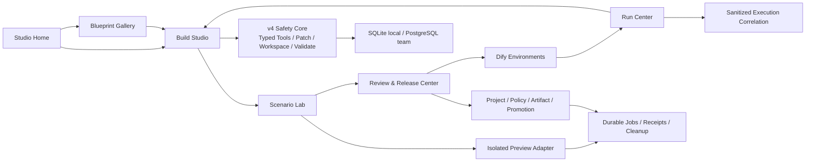

# Chat2Dify v5.0.0: AI Workflow Studio

> - Status: Proposed
> - Target branch: `v5.0.0`
> - Baseline: released Chat2Dify `v4.0.0`
> - Decision date: 2026-07-30
> - Product direction: make Dify application building, testing, releasing, and
>   operating feel like one coherent AI-native product.

## 1. Product decision

The next release is `v5.0.0`, not `v4.0.1`.

v4 proved the safety core: one Builder Agent, Typed Tools, transactional Patch
IR, versioned Workspace, deterministic validation, review, exact approval,
Hash conflict protection, repair, recovery, and audit.

v5 should turn that foundation into a product users want to live in every day:

```text
Chat2Dify AI Workflow Studio

Build Studio
  → Blueprint Gallery
  → Scenario Lab
  → Release Center
  → Run Center
```

This is a product upgrade because the primary journey, navigation, information
architecture, collaboration model, testing experience, and post-release
experience all change. Identity, persistence, environments, workers, Git, and
MCP are supporting architecture, not the headline.

## 2. Product positioning

Chat2Dify should not compete with n8n by copying connector count or by becoming
a second workflow runtime.

Its differentiated promise is:

> Describe a Dify application in business language, co-build it safely with
> AI, prove its quality with scenarios, release the exact reviewed version,
> and turn production failures into repair proposals.

The target users are:

- business builders who know the outcome but not every Dify node;
- AI application engineers who need precise control and reproducibility;
- reviewers who need understandable evidence rather than raw DSL;
- operators who need to connect a production incident to the deployed
  workflow version and propose a safe fix;
- teams that want reusable application patterns without giving a model direct
  production write authority.

## 3. Current product baseline

The current repository already provides:

| User-facing capability | Implementation evidence |
| --- | --- |
| Natural-language creation and modification | v3 assistant plus v4 Builder Runtime |
| Workflow/Chatflow create and modify | `app/agent/service.py`, `app/agent/commit.py` |
| Chatbot/Completion/Agent modification | `app/agent/config_app.py`, `app/agent/config_commit.py` |
| Dify-hosted Workbench and selected-node context | `app/static/agent-workbench.js`, `deploy/dify/web-adapter/` |
| Goal Plan, Timeline, Diff, Approval, Pause/Resume, Undo | v4 Workbench and `/api/v4/agent` |
| Draft Test → Inspect → Repair | `app/agent/execution.py`, `app/agent/tools/draft_run.py` |
| Skills and fixed release evaluations | `app/agent/skills.py`, `app/evals/` |
| Safe writes | transactional Patch, deterministic validation, exact approval, Dify Hash re-read |

The v4 release ledger records `462 passed, 12 skipped`, real Dify `1.14.2`
acceptance, Workbench tests, and ten deterministic Runtime evaluation cases.
The complete evidence remains in
[`docs/archive/v4.0.0-tasks.md`](../archive/v4.0.0-tasks.md).

The main product gaps are:

- the Workbench is a capable drawer, not yet a complete application studio;
- users see one Builder path, not multiple candidate solutions they can
  compare;
- the catalog is technical and limited; there is no productized pattern
  gallery or guided setup;
- tests are approval-driven tool calls, not a visual scenario and comparison
  product;
- release is still split across v4 Commit and v3 Publish, without a coherent
  Release Center;
- collaboration is not a first-class experience;
- production executions are not connected back to the exact reviewed version;
- users cannot turn a failure into a pre-filled, evidence-backed repair
  proposal;
- there is no unified Studio home showing apps, drafts, reviews, quality,
  releases, and incidents.

## 4. n8n comparison

This comparison uses n8n's official documentation as of 2026-07-30 and
compares documented behavior only.

| Product dimension | n8n documented experience | Chat2Dify opportunity |
| --- | --- | --- |
| AI building | AI Workflow Builder creates, refines, and debugs workflows, including node choice, placement, and configuration | Go deeper on Dify: selection-aware co-editing, safe candidate variants, deterministic validation, exact Diff/approval, and business-readable explanations |
| Human approval | AI Agent tools can pause and request approval through chat and communication channels | Productize both design-time review and runtime tool approval in one Review Inbox, bound to the exact version and risk |
| Evaluations | Light and metric-based evaluations use datasets before and after deployment | Turn the existing deterministic eval core into a visual Scenario Lab with datasets, side-by-side candidates, quality/cost/latency, and regression gates |
| Reuse | Sub-workflows and conversion help modularize large workflows | Offer a Blueprint Gallery for Dify-native patterns that expand through safe Patch IR and include setup forms, validation, examples, and evals |
| Governance | Projects, RBAC, source-control environments, and external secrets support teams | Make governance invisible until needed: project sharing, reviewer roles, Release Center, environment mappings, and policy explanations inside the product journey |
| Operations | Executions, debug data, error workflows, logs, and scalable workers support operations | Add a Run Center that correlates Dify executions to released versions and creates safe repair proposals from sanitized failures |
| Extensibility | Built-in/community nodes and an instance-level MCP server provide broad reach | Reuse Dify models, datasets, tools, triggers, plugins, and MCP; expose Chat2Dify's safe inspect/propose/evaluate surface without competing on connector count |

Official references:

- [n8n AI Workflow Builder](https://docs.n8n.io/build/ways-of-building-workflows/ai-workflow-builder)
- [n8n human-in-the-loop for tools](https://docs.n8n.io/build/integrate-ai/ai-examples/human-in-the-loop-for-tools)
- [n8n evaluations](https://docs.n8n.io/build/integrate-ai/test-and-improve-ai-workflows/understand-why-to-test)
- [n8n sub-workflows](https://docs.n8n.io/build/flow-logic/break-workflows-into-smaller-parts)
- [n8n RBAC](https://docs.n8n.io/administer/manage-users-and-access/set-permissions-and-roles-rbac)
- [n8n source control and environments](https://docs.n8n.io/administer/use-source-control-and-environments)
- [n8n external secret stores](https://docs.n8n.io/administer/manage-credentials/use-external-secret-stores)
- [n8n queue mode](https://docs.n8n.io/deploy/host-n8n/configure-n8n/scaling/enable-queue-mode)
- [n8n error handling](https://docs.n8n.io/build/flow-logic/handle-errors-gracefully)
- [n8n MCP server](https://docs.n8n.io/connect/connect-to-n8n-mcp-server)
- [n8n community nodes](https://docs.n8n.io/integrations/community-nodes)

## 5. Advantages to turn into product features

### 5.1 Safe candidate variants

v4 already keeps edits in a server-side Workspace and does not touch Dify
before approval. v5 can let a user ask for two or three approaches, compare
their business behavior, node Diff, quality, cost, and risk, then choose one.

Each candidate remains a normal Workspace branch with typed Patch history.
There is no model-authored raw DSL and no unreviewed merge.

### 5.2 Business view backed by technical proof

The Workbench already separates business Diff from technical details. v5
should make this the default product language:

```text
Business intent
Expected behavior
Changed path
Test evidence
Risk and side effects
Release impact
Technical details
```

Reviewers should not need to understand node IDs to make a good decision, but
the exact Patch, Plan, Artifact Hash, validation, and execution evidence remain
available.

### 5.3 Dify-native guided building

The existing Dify host integration knows the application, selected nodes,
dirty state, and draft Hash. v5 can provide contextual commands such as:

- explain this node and its inputs;
- show two safer ways to add a fallback;
- extract the selected pattern as a Blueprint;
- generate test scenarios for this branch;
- compare this model with the project default;
- show why this release is blocked.

### 5.4 Review that cannot drift

The exact v4 Approval binding can become a productized Review Inbox. A review
card represents one immutable candidate/release proposal. Any candidate,
mapping, policy, or target change visibly invalidates the stale decision.

### 5.5 Failures become repair proposals

v4 normalizes validation and Draft execution errors. v5 should correlate
production executions to the released Artifact and offer:

```text
Incident → sanitized evidence → suspected node → repair proposal
         → Scenario regression → Review → Release
```

The system proposes; it does not silently modify or republish production.

## 6. Product information architecture

### 6.1 Studio Home

The default landing page shows:

- recently edited applications;
- active Change Requests;
- reviews waiting for the user;
- quality regressions;
- releases and environment drift;
- incidents needing attention;
- recommended Blueprints based on app mode and selected use case.

### 6.2 Build Studio

Build Studio combines:

- Dify canvas and configuration context;
- natural-language composer;
- Goal Plan;
- candidate tabs;
- contextual node inspector;
- guided resource mapping;
- business preview;
- validation and risk;
- side-by-side candidate comparison;
- one-click handoff to Scenario Lab or Review.

The first release should support:

- Workflow and Chatflow creation/modification;
- Chatbot, Completion, and Agent creation/modification;
- the node families already supported by v3 Plan IR;
- explicit node removal and safe pattern replacement;
- auto-layout preview without mutating unrelated layout;
- “explain before changing” and “show alternatives” commands.

### 6.3 Blueprint Gallery

Blueprint Gallery contains reusable product patterns, not raw graph snippets:

- business name and outcome;
- preview diagram;
- supported Dify/app versions;
- setup form;
- required models, datasets, tools, triggers, and approvals;
- estimated cost/risk;
- included scenarios and expected results;
- version, provenance, deprecation, and upgrade notes.

Initial Blueprints:

- knowledge retrieval with grounded answer;
- human fallback;
- structured JSON extraction;
- document intake;
- webhook ingestion;
- scheduled report;
- error handling and retry;
- model fallback/routing;
- customer-support classification.

Applying a Blueprint expands into one normal typed Patch transaction and uses
the same validation, Diff, policy, review, and server-generated IDs.

### 6.4 Scenario Lab

Scenario Lab lets a user:

- create examples manually or from approved sanitized runs;
- generate edge cases after the input schema is known;
- organize datasets by business capability;
- run one or more candidate versions;
- compare output quality, expected invariants, latency, model usage, estimated
  cost, and side effects;
- inspect a failed node without seeing secrets;
- save a run as the new baseline;
- make a regression threshold required for release.

Dify `1.14.2` cannot execute an uncommitted candidate Graph. Therefore a real
candidate run requires a configured, isolated Preview Environment. The product
must show this boundary honestly rather than labeling a persisted-draft result
as candidate evidence.

### 6.5 Review and Release Center

The Release Center shows:

- candidate summary and business Diff;
- Scenario Lab evidence;
- required reviewers and comments;
- target environment and resource mappings;
- current deployed version and drift;
- release notes generated from deterministic Diff;
- approval status and expiry;
- release receipt, resulting Dify Hash, and rollback action.

Projects can start with only one environment. Dev/staging/prod, Git
serialization, separation of duties, and policy gates are progressive
capabilities, not setup requirements for an individual user.

### 6.6 Run Center

Run Center shows:

- executions grouped by application and released Artifact;
- success/error trend;
- failed node and stable error class;
- latency, model usage, and estimated cost summaries when available;
- alerts and error clusters;
- linked scenarios and known regressions;
- “create repair proposal” action;
- repair progress through Build → Scenario → Review → Release.

It must not persist raw secrets, full sensitive payloads, or model
chain-of-thought.

## 7. Supporting platform capabilities

These capabilities exist to enable the product surfaces:

### 7.1 Projects and collaboration

Initial roles:

```text
owner
admin
builder
reviewer
viewer
```

Every Studio object is project-scoped. Authorization happens before a read.
High-risk policy can require a reviewer other than the author.

### 7.2 Trusted Dify identity and host context

Studio authenticates a browser session by asking the configured Dify host for
the current account, Workspace, and accessible applications. It forwards only
the allowlisted Dify access/refresh/CSRF cookies, derives the required
`X-CSRF-Token` header, never persists or logs cookie values, and may perform
one Dify refresh-token exchange before failing closed. Refreshed HttpOnly
cookies are returned to the same-origin browser.

The resulting short-lived Studio session binds issuer, audience, subject,
Dify tenant, personal Project, origin, one-time nonce, JTI, issued-at, and
expiry. Every authenticated request revalidates the current Dify session and
Project membership. Browser-claimed user, role, Project, app, tenant, or
environment values do not authorize.

There are two honest Build context modes:

- a Build entry opened from the Dify canvas requires the existing
  origin/source/nonce handshake and dirty-state/Hash protection;
- an application opened from Studio Home is explicitly marked as a Home
  entry, reads the Dify-persisted Draft server-side, and does not pretend to
  have canvas selection or dirty-state context.

### 7.3 Artifact and environment model

An immutable Workflow Artifact contains canonical Plan/config, compatibility,
capability requirements, resource references, scenario suite reference,
provenance, and content Hash. It contains no secrets.

An Environment maps one logical app to a Dify target/app ID and maps opaque
model/dataset/tool/trigger/credential references to that environment.

### 7.4 Isolated Preview Environment

Candidate execution requires:

- a non-production Dify target;
- restricted test resource mappings;
- no production credentials;
- import/sync receipts;
- fixture labels and TTL;
- idempotent cleanup and independent absence verification;
- reconciliation for ambiguous imports;
- policy approval for external side effects.

### 7.5 Durable delivery

SQLite remains available for local/single-user use. PostgreSQL and durable
leases/outbox workers support team deployments. At-least-once job delivery
must never become duplicate Dify, Git, notification, or cleanup writes.

### 7.6 Safe API and MCP

External clients may inspect projects/artifacts, create a Change Request,
propose typed changes, run/read scenarios, read review, and preview a release.

Approval decisions, Commit, Publish, credential plaintext, raw DSL, and
arbitrary Patch remain unavailable to model-visible MCP tools.

## 8. Product architecture



## 9. v5 release scope

v5.0.0 includes:

1. Studio Home and product navigation.
2. Build Studio with candidate variants and comparison.
3. Chatbot, Completion, and Agent creation in the v5 product path.
4. Typed mutation coverage for the node families already supported by v3.
5. Blueprint Gallery with initial Dify-native patterns.
6. Scenario Lab with datasets, comparisons, metrics, and regression gates.
7. Isolated Preview Environment for real uncommitted candidate execution.
8. Team projects, comments, review roles, and policy.
9. Release Center with environments, drift, mappings, release notes, receipts,
   rollback, and optional Git serialization.
10. Run Center with Artifact-correlated execution summaries and repair
    proposals.
11. Durable team deployment and scoped API/MCP for safe automation.

The following remain out of v5.0.0:

- a standalone workflow runtime;
- a Chat2Dify connector marketplace;
- autonomous production Publish;
- plaintext credential access or secret creation;
- candidate tests with production credentials;
- arbitrary JSON Patch or raw DSL mutation;
- runtime multi-agent orchestration;
- automatic sub-workflow decomposition;
- automatic Git push/merge or environment promotion;
- vector-database replacement for structured product data.

## 10. Delivery milestones

The executable tasks are in [`docs/tasks.md`](../tasks.md).

```text
Phase 0: Studio shell, projects, identity, and product foundations
  → Phase 1: Build Studio and candidate variants
  → Phase 2: Blueprint Gallery
  → Phase 3: Scenario Lab and isolated Preview
  → Phase 4: Review and Release Center
  → Phase 5: Run Center and safe automation
  → Release Gate
```

Every phase must ship a coherent user journey with real UI, authorization,
persistence, negative paths, and product documentation. Backend-only
scaffolding does not complete a phase.

## 11. Non-negotiable invariants

```text
cross_project_access_is_denied
browser_claimed_identity_never_authorizes
model_or_mcp_cannot_approve
candidate_variant_is_a_normal_versioned_workspace
blueprint_apply_uses_normal_patch_transaction
failed_patch_does_not_change_head
approval_for_release_A_cannot_release_B
release_rechecks_target_hash_and_policy
preview_never_receives_production_secret_mapping
ambiguous_preview_import_is_not_retried_blindly
worker_restart_does_not_duplicate_external_write
unsupported_dify_mutation_fails_closed
v4_feature_flag_path_remains_compatible
```

## 12. Product success metrics

v5.0.0 release targets:

- time from goal to first valid candidate: median `< 3 minutes` in the fixed
  usability set;
- users completing Build → Scenario → Review without opening raw technical
  details: `>= 80%`;
- supported candidate validity before review: `100%`;
- unrelated workflow preservation: `>= 99%`;
- initial Blueprint application success: `>= 95%`;
- fixed Scenario Lab goal completion: `>= 90%`;
- designated production failures converted into reviewable repair proposals:
  `>= 80%`;
- unauthorized or unapproved external writes: `0`;
- secret values in Artifact, UI evidence, Git, Trace, model context, eval
  report, notification, audit, or MCP output: `0`;
- Preview fixture cleanup verified: `100%`;
- every failed user action has a business-readable reason and next step;
- v3 and v4 regression suites remain green.
